## 1 基础部分

**Go语言基本结构及说明**

```go
package main
import (
    "fmt"
    "runtime"
)
func main()  {
    fmt.Println("hello world")
    // 查看版本
    fmt.Println(runtime.Version())
}
```

**func main()是程序入口。所有Go函数以关键字func开头，每一个可执行程序都必须包含main()函数，通常是程序启动后第一个执行的函数，如果有init()函数则会先执行init()函数。**

除此之外，还有以下几点值得注意。

- （1）只有package名称为main的包可以包含main()函数。
- （2）一个可执行程序有且仅有一个main包。
- （3）通过import关键字来导入其他非main包。
- （4）可以通过import关键字单个导入，也可以同时导入多个。

## 2 基本语法

### 2.1 变量

变量的本质是计算机分配的一小块内存，专门用于存放指定数据，在程序运行过程中该数值可以发生改变；变量的存储往往具有瞬时性，或者说是临时存储，当程序运行结束，存放该数据的内存就会释放，该变量就会随着内存的释放而消失。就像日常生活中存放水的水杯，当水杯损坏的时候，装在里面的水也会流失掉。

**变量又分为局部变量和全局变量。**

- 局部变量，是定义在大括号（{}）内部的变量，大括号的内部也是局部变量的作用域。
- 全局变量，是定义在函数和大括号（{}）外部的变量。

Go 语言的变量名由字母、数字、下画线组成，首个字符不能为数字；`Go 语法规定，定义的局部变量若没有被调用会发生编译错误。`

**变量声明**

**未初始化变量的默认值有如下特点：**

- 整型和浮点型变量默认值：0。
- 字符串默认值为空字符串。
- 布尔型默认值为false。
- 函数、指针变量、切片默认值为nil。

**初始化变量的标准格式如下：**

```go
var a int = 199 //初始化变量的标准格式
var b = 100 //初始化变量的编译器自动推断类型格式
c := 123 //初始化变量的简短声明格式
```

**使用 := 赋值操作符可以高效地创建一个新的变量，称为初始化声明。声明语句省略了 var 关键字，变量类型将由编译器自动推断。这是声明变量的首选形式，但是它只能被用在函数体内，而不可以用于全局变量的声明与赋值。该变量名必须是没有定义过的变量，若定义过，将发生编译错误。**

```go
package main
func main(){
  // 这样写是错误的
    var a = 123
    a := 222
}
```

```go
./variable.go:7:4: no new variables on left side of :=
```

多个短变量声明和赋值中，至少有一个新声明的变量出现在左侧，那么即便其他变量名可能是重复声明的，编译器也不会报错。情况如下所示：

```go
package main
import "fmt"
func main(){
  // 这种情况不会报错
    var a = 666
    a, b := 1,2
    fmt.Println("a>>>",a) // 1
    fmt.Println("n>>>",b) // 2
}
```

虽然这种方法不会报错，但是在使用过程中应尽量避免。

**变量多重赋值**

变量多重赋值是指多个变量同时赋值。

Go语法中，变量初始化和变量赋值是两个不同的概念。Go语言的变量赋值与其他语言一样，但是Go提供了其他程序员期待已久的多重赋值功能，可以实现变量交换。多重赋值让Go语言比其他语言减少了代码量。

go语言中使用多重赋值进行变量交换的例子：

```go
package main
import "fmt"
func main(){
    var a = 666
    a, b := 111,222
    // 变量交换
    b, a = a, b
    fmt.Println("a>>>",a) // 222
    fmt.Println("n>>>",b) // 111
}
```

**需要注意的是，多重赋值时，左值和右值按照从左到右的顺序赋值。这种方法在错误处理和函数当中会大量使用。**

**匿名变量**

Go语言的函数可以返回多个值，而**事实上并不是所有的返回值都用得上**。那么就可以使用匿名变量，用下画线“_”替换即可。

例如，定义一个函数，功能为返回两个int型变量，第一个返回10，第二个返回20，第一次调用舍弃第二个返回值，第二次调用舍弃第一个返回值，具体语法格式如下所示。

```go
package main
import "fmt"

func getData()(int, string, bool){
    return 666,"whw",false
}

func main(){
    var a = 666
    a, b, _ := getData()
    fmt.Println("a>>>",a) // 666
    fmt.Println("n>>>",b) // whw
}
```

**匿名变量既不占用命名空间，也不会分配内存。**

### 2.2 数据类型

在Go语言中，有以下几种数据类型：

**基本数据类型（原生数据类型）**：整型、浮点型、复数型、布尔型、字符串、字符（byte、rune）。

**复合数据类型（派生数据类型）**：数组（array）、切片（slice）、映射（map）、函数（function）、结构体（struct）、通道（channel）、接口（interface）、指针（pointer）。

#### 整型

整型分两大类。有符号整型：int8、int16、int32、int64、int。

无符号整型：uint8、uint16、uint32、uint64、uint。

其中uint8就是byte型，int16对应C语言的short型，int64对应C语言的long型。

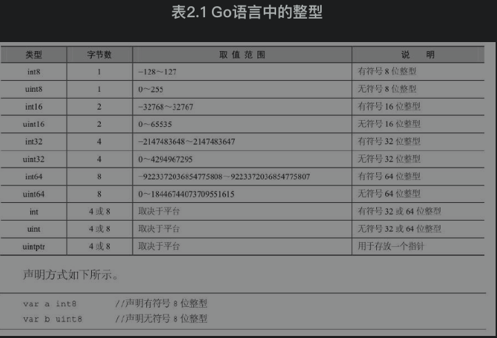

#### 浮点型

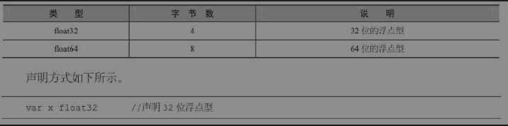

常量math.MaxFloat32表示float32能获取的最大值，大约是3.4×1038；常量math.SmallestNonzeroFloat32表示float32能获取的最小值，大约为1.4×10-45。

常量math.MaxFloat64表示float64能获取的最大值，大约是1.8×10308；常量math.SmallestNonzeroFloat64表示float64能获取的最小值，大约为4.9×10-324。

#### 复数型

复数型用于表示数学中的复数，如1+2j、1-2j、-1-2j等。关于复数型的说明，如表2.3所示。

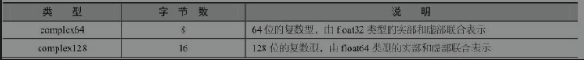

#### 布尔型

布尔型用预定义标识符bool表示。在C语言中，对于布尔型的值定义，非0表示真，0表示假。而在Go语言中，布尔型的值只可以是常量true或者false。

声明方式如下所示。

```go
var flag bool
```

**布尔型无法参与数值运算，也无法与其他类型进行转换。**

#### 字符串

字符串在Go语言中是以基本数据类型出现的，使用字符串就像使用其他原生基本数据类型int、float32、float64、bool一样。

字符串在C++语言中，以类的方式进行封装，不属于基本数据类型。

在go中使用字符串：

```go
var s1 string //定义名为s1的字符串类型变量
s1 = "HelloWorld" //变量赋值

student1 := "火影whw" //以自动推断方式初始化
```

有些字符串没有现成的文字代号，所以只能用转义字符来表示。常用的转义字符如表2.4所示：

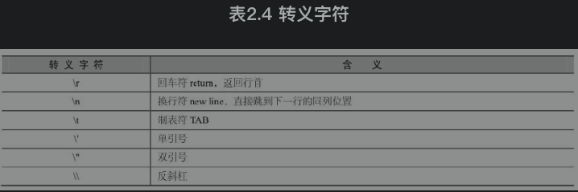

**定义多行字符串的方法如下：**

- 双引号书写字符串被称为字符串字面量（string literal），这种字面量不能跨行。
- 多行字符串需要使用反引号“`”，多用于内嵌源码和内嵌数据。
- 在反引号中的所有代码不会被编译器识别，而只是作为字符串的一部分。
- 多行字符串定义方式如例2-1所示。

```go
package main
import "fmt"

func getString()(string){
    s1 := `
        x := 123
        y := 666
        ss := "A Hero's Country!"
     `
    return s1
}

func main(){
    a := getString()
    fmt.Println("a>>>",a)
}
```

#### 字符

字符串中的每一个元素叫作“字符”，定义字符时使用单引号。Go语言的字符有两种，如表2.5所示。

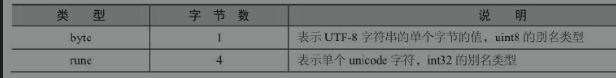

声明示例如下（注意必须是单引号！）：

```go
package main
import "fmt"

func main(){
    // 注意必须是单引号！！！
    var a byte = 's'
    var b rune = '王'
    fmt.Println("a>>>",a) // 115
    fmt.Println("b>>>",b) // 29579
}
```

### 2.3 打印格式化

打印格式化通常使用fmt包，通用的打印格式如表：

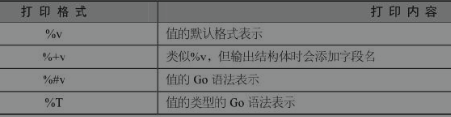

具体的使用方法：

```go
package main
import "fmt"
func main(){
    str := "wanghw"
    fmt.Printf("%T, %v \n",str,str) //string, wanghw

    var a rune = '王'
    fmt.Printf("%T, %v \n",a,a) //int32, 29579

    var b byte = 'b'
    fmt.Printf("%T, %v \n",b,b) //uint8, 98

    var c int32 = 123
    fmt.Printf("%T, %v \n",c,c) //int32, 123
}
```

通过上例可以看出，使用通用的格式打印，输出的结果可能不是自己想要的，为了确保输出结果与需求一致，还需要学习具体格式的打印方式。

#### **布尔型打印格式**

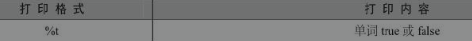

```go
package main

import "fmt"

func main(){
    var flag bool
    // flag默认是false
    fmt.Printf("%T, %t \n",flag,flag) //bool, false

    flag = true
    fmt.Printf("%T, %t \n",flag,flag) //bool, true
}
```

#### **整型打印格式**

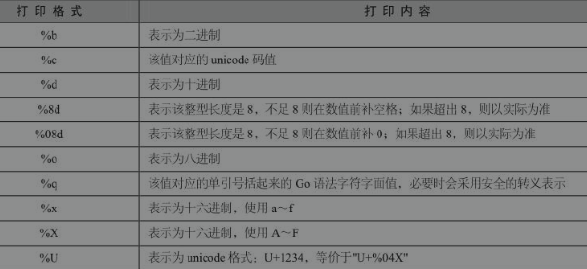

```go
package main
import "fmt"
func main(){
    fmt.Printf("%T, %d \n",123, 123) //int, 123
    fmt.Printf("%T, %5d \n",123, 123) //int,   123
    fmt.Printf("%T, %05d \n",123, 123) //int, 00123
    fmt.Printf("%T, %b \n",123, 123) //int, 1111011
    fmt.Printf("%T, %o \n",123, 123) //int, 173
    fmt.Printf("%T, %c \n",98, 98) //int, b
    fmt.Printf("%T, %q \n",98, 98) //int, 'b'
    fmt.Printf("%T, %x \n",123, 123) //int, 7b
    fmt.Printf("%T, %X \n",123, 123) //int, 7B
    fmt.Printf("%T, %U \n",'王', '王') //int32, U+738B
}
```

#### **浮点型与复数型打印格式**

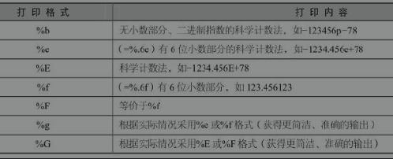

```go
package main
import "fmt"
func main(){
    fmt.Printf("%b \n",123.23433) //8671845041675824p-46
    fmt.Printf("%f \n",123.2) //123.200000
    fmt.Printf("%.2f \n",123.22222) //123.22
    fmt.Printf("%e \n",123.22222) //1.232222e+02
    fmt.Printf("%E \n",123.22222) //1.232222E+02
    fmt.Printf("%.1e \n",123.22222) //1.2e+02
    fmt.Printf("%F \n",123.22222) //123.222220
    fmt.Printf("%g \n",123.22222) //123.22222
    fmt.Printf("%G \n",123.22222) //123.22222 
}
```

#### **关于复数的打印格式如下**

```go
package main
import "fmt"
func main(){
    var value complex64 = 2.2 + 22i
    value2 := complex(2.2,222)
    fmt.Println(real(value)) //2.2
    fmt.Println(imag(value)) //22
    fmt.Println(value2) //(2.2+222i)
}
```

#### **字符串打印与字节数组的打印格式**

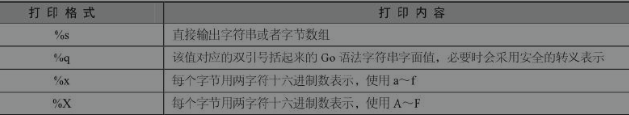

```go
package main
import "fmt"
func main(){
    arr := []byte{'a','b','c','d'}
    fmt.Printf("%s \n","火影whw")//火影whw
    fmt.Printf("%q \n","火影whw")//"火影whw"
    fmt.Printf("%x \n","火影whw")//e781abe5bdb1776877
    fmt.Printf("%X \n","火影whw")//E781ABE5BDB1776877

    fmt.Printf("%T, %s \n",arr, arr)//[]uint8, abcd
    fmt.Printf("%T, %q \n",arr, arr)//[]uint8, "abcd"
    fmt.Printf("%T, %x \n",arr, arr)//[]uint8, 61626364
    fmt.Printf("%T, %X \n",arr, arr)//[]uint8, 61626364 
}
```

### 2.4 数据类型转换

Go语言采用数据类型前置加括号的方式进行类型转换，格式如：T（表达式）。T表示要转换的类型；表达式包括变量、数值、函数返回值等。

类型转换时，需要考虑两种类型之间的关系和范围，是否会发生数值截断。就像将1000毫升的水倒入容积为500毫升的瓶子里，余出来500毫升的水便会流失。值得注意的是，**布尔型无法与其他类型进行转换**。

```go
package main
import "fmt"
func main(){
    a := 100
    b1 := float64(a)
    b2 := string(a)
    fmt.Println("b1>>>",b1)
    fmt.Println("b2>>>",b2)
}
```

#### **浮点型与整型之间转换**

**float和int的类型精度不同，使用时需要注意float转int时精度的损失。**

```go
package main

import "fmt"

func main() {
    chinese := 90
    english := 98.9

    avg1 := (chinese + int(english)) / 2
    avg2 := (float64(chinese) + english) / 2

    fmt.Println("avg1>>>",avg1) // 94
    fmt.Println("avg2>>>",avg2) // 94.45
}
```

#### **整型转字符串类型**

这种类型的转换，其实相当于byte或rune转string。

**int数值是ASCII码的编号或unicode字符集的编号，转成string就是根据字符集，将对应编号的字符查找出来。当该数值超出unicode编号范围，则转成的字符串显示为乱码。**例如，19968转string，就是“一”。

备注：

- ASCII字符集中数字的十进制范围是48～57；
- ASCII字符集中大写字母的十进制范围是65～90；
- ASCII字符集中小写字母的十进制范围是97～122；
- unicode字符集中汉字的范围是4e00～9fa5，十进制范围是19968～40869。

详情如下：

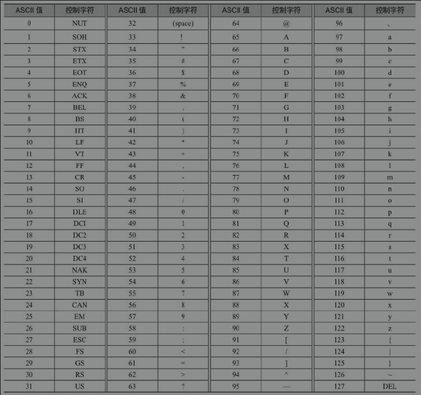

具体的使用方法如下：

```go
package main
import "fmt"
func main() {
    a := 97
    x := 19969

    ret1 := string(a)
    ret2 := string(x)
    fmt.Println("ret1>>>",ret1) // a
    fmt.Println("ret2>>>",ret2) // 丁
}
```

**Go语言中不允许字符串转int**

```go
package main
import "fmt"
func main() {
    a := "丁"
  // 不能将字符串转为int
    ret1 := int64(a)
    fmt.Println("ret1>>>",ret1) // a
}
```

会上报下面的错误：

```go
cannot convert a (type string) to type int64
```

### 2.5 常量

常量是一个简单值的标识符，在程序运行时，不会被修改。常量中的数据类型只可以是布尔型、数字型（整型、浮点型和复数型）和字符串。常量的定义格式如下：

```go
const A string = "wanghw"

const B = "whw"

const C, D = "www", "waa"
```

**常量定义后未被使用，不会在编译时报错。**

#### 常量用于枚举

Go语言现阶段没有提供枚举，可以使用常量组模拟枚举。

假设数字0、1和2分别代表未知性别、女性和男性。格式如例：

```go
package main
import "fmt"
const (
    Unknown = 0
    Female = 1
    Male = 2
)
func main(){
    fmt.Println("ret>>",Unknown, Female, Male)
    // 结果
    // ret>> 0 1 2
}
```

常量组中如果不指定类型和初始值，则与上一行非空常量的值相同：

```go
package main
import "fmt"
const (
    a = 10
    b
    c
)
func main(){
    fmt.Println("ret>>",a, b, c)
    // 结果
    // ret>> 10 10 10
}
```

#### iota

iota，特殊常量值，是一个系统定义的可以被编译器修改的常量值。

iota只能被用在常量的赋值中，在每一个const关键字出现时，被重置为0，然后每出现一个常量，iota所代表的数值会自动增加1。

iota可以理解成常量组中**常量的计数器**，不论该常量的值是什么，**只要有一个常量，那么iota就加1**。

```go
package main
import "fmt"
const (
    a = 12
    b = iota
    c = iota
)
func main(){
    fmt.Println("ret>>",a, b, c)
    // 结果
    // ret>> 12 1 2
}
```

常量组中如果不指定类型和初始值，则与上一行非空常量的值相同：

```go
package main
import "fmt"
const (
    a = iota
    b
    c
)
func main(){
    fmt.Println("ret>>",a, b, c)
    // 结果
    // ret>> 0 1 2
}
```

### 2.6 类型别名与类型定义

类型别名是Go1.9版本添加的新功能。说到类型别名，无非是给类型名取一个有特殊含义的外号而已，就像武侠小说中的东邪西毒。假如在教室中，有两个同学叫张三，老师为了区分他们，通常会给他们起个别名：大张三、小张三。对于编程而言，类型别名主要用于解决兼容性的问题。

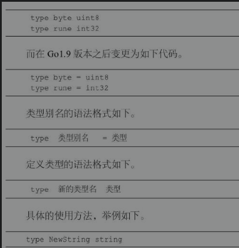

该语句是将NewString定义为string类型。通过type关键字，NewString会形成一种新的类型。NewString本身依然具备string的特性。

```go
type StringAliaa = string
```

该语句是将StringAlias定义为string的一个别名。使用StringAlias与string等效。别名类型只会在代码中存在，编译完成时，不会有别名类型。

出于对程序性能的考虑，建议如下：

- 尽可能地使用 := 去初始化声明一个变量（在函数内部）。
- 尽可能地使用字符代替字符串。

### 2.7 Go语言运算符

运算符用于在程序运行时执行数学或逻辑运算。

Go语言内置的运算符包括**算术运算符**、**关系运算符**、**逻辑运算符**、**位运算符**、**赋值运算符**、**其他运算符**。

**逻辑运算符**

Go语言的逻辑运算符如表所示。假定A值为True，B值为False。

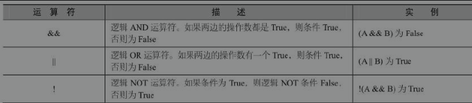

**位运算符**

位运算符**对整数在内存中的二进制位进行操作**。

位运算符比一般的算术运算符速度要快，而且可以实现一些算术运算符不能实现的功能。如果要开发高效率程序，位运算符是必不可少的。位运算符用来对二进制位进行操作，包括：按位与（＆）、按位或（|）、按位异或（^）、按位左移（＜＜）、按位右移（＞＞）。

Go语言支持的位运算符如表2.15所示。假定A为60，B为13：

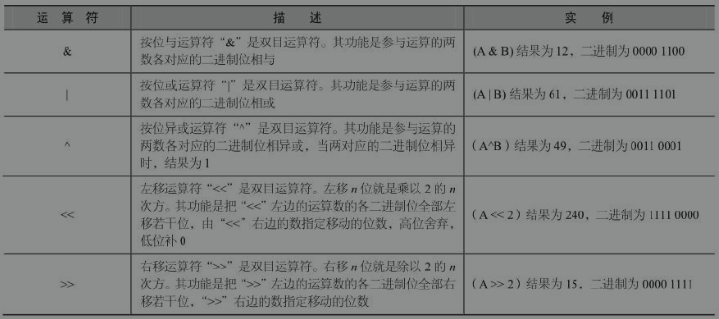

（其他略）

**其他运算符**

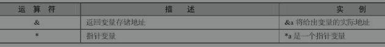

**运算符优先级**

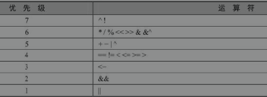

当然，读者可以通过使用括号来临时提升某个表达式的整体运算优先级。

## 3 Go语言的流程控制

### 3.1 流程控制概述

### 3.2 if条件判断语句

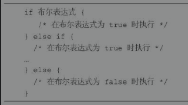

先判断if的布尔表达式，如果为true，其后紧跟的语句块执行，如果为false，再判断else if的布尔表达式，如果为true，其后紧跟的语句块执行，如果为false，再判断下一个else if的布尔表达式，以此类推，当最后一个else if的表达式为false时，执行else语句块。

在if语句的使用过程中，应注意以下细节：

- 不需使用括号将条件包含起来。
- 大括号{}必须存在，即使只有一行语句。
- 左括号必须在if或else的同一行。
- 在if之后，条件语句之前，可以添加变量初始化语句，使用“;”进行分隔。

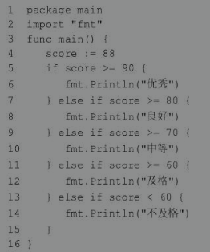

### if的特殊写法

if语句还有一个变体。它的语法如下所示。

```go
if statement; condition {
  // 代码块
}
```

```go
package main
import "fmt"

func main(){
    if num := 10; num %2 == 0{
        fmt.Println("偶数")
    } else{
        fmt.Println("奇数")
    }
}
// 结果
// 偶数
```

**需要注意的是，num的定义在if里，那么只能够在该if...else语句块中使用，否则编译器会报错。**

### 3.3 if嵌套语句

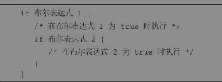

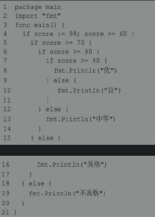

### 3.4 switch语句

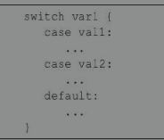

switch语句执行的过程自上而下，直到找到case匹配项，匹配项中无须使用break，因为Go语言中的switch默认给每个case自带break。因此匹配成功后不会向下执行其他的 case 分支，而是跳出整个 switch。可以添加fallthrough（中文含义是：贯穿），强制执行后面的case分支。fallthrough必须放在case分支的最后一行。如果它出现在中间的某个地方，编译器就会报错。变量var1可以是任何类型，而val1和val2则可以是同类型的任意值。类型不局限于常量或整数，但必须是相同类型或最终结果为相同类型的表达式。case后的值不能重复，但可以同时测试多个符合条件的值，也就是说case后可以有多个值，这些值之间使用逗号分隔，例如：case val1, val2, val3。switch后的表达式可以省略，默认是switch true。

**示例**


**接下来再看一个案例，判断某年某月的天数**

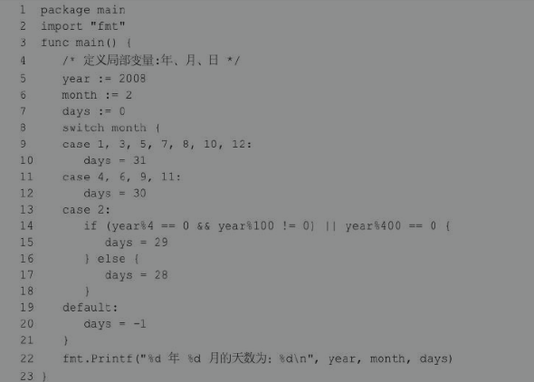

**类型转换**

switch语句还可以被用于type switch（类型转换）来判断某个interface变量中实际存储的变量类型。关于interface变量的知识将在后续的章节中介绍。下面演示type switch的语法。其语法结构如下所示。

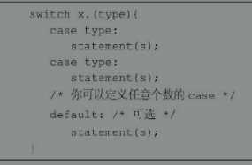

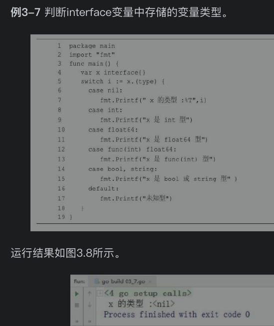

### 3.5 for循环语句

循环语句表示当条件满足时，可以反复地执行某段代码。

for是Go语言中唯一的循环语句，Go没有while、do...while循环。

按语法结构来分，Go语言的for循环有4种形式，只有第一种使用分号。

for循环中for关键字后不能加小括号。

#### 语法结构一

```go
for 初始预计init; 条件表达式condition; 结束语句post {
  // 循环体代码
}
```

**先执行初始语句，对控制变量赋初始值。初始语句只执行一次。**

**其次根据控制变量判断条件表达式的返回值，若其值为true，满足循环条件，则执行循环体内语句，之后执行结束语句，开始下一次循环。**

**执行结束语句之后，将重新计算条件表达式的返回值，如果是true，循环将继续执行，否则循环终止。然后执行循环体外语句。**

```go
package main
import "fmt"
func main(){
    for i:=0; i<10; i++{
        fmt.Printf("%d ", i)
    }
}
//0 1 2 3 4 5 6 7 8 9 
```

初始语句、条件表达式和结束语句3种组成部分都是可选的。因此这种基本的for循环语法结构又能演化出4种略有不同的写法。

**初始语句是在第一次循环前执行的语句，一般为赋值表达式，给控制变量赋初始值。如果控制变量在此处被声明，其作用域将被局限在这个for的范围内——在for循环中声明的变量仅在循环范围内可用。初始语句可以省略不写，但是初始语句之后的分号必须要写。**

省略初始语句的写法：

```go
package main
import "fmt"
func main(){
    a := 3
    for ; a<5; a++{
        fmt.Printf("%d ", a)
    }
}
//3 4
```

**条件表达式（condition）是控制循环与否的开关：如果表达式为true，则循环继续；否则结束循环。条件表达式可以省略不写，之后的分号必须要写。省略条件表达式默认形成无限循环。**

省略条件表达式的写法：

```go
package main
import "fmt"
func main(){
    a := 3
    for ; ; a++ {
        if a > 5 {
            fmt.Printf("%d ", a)
            break
        }
    }
}
//6
```

**结束语句（post），一般为赋值表达式，使控制变量递增或者递减。post语句将在循环的每次成功迭代之后执行。**

#### 语法结构二

**for关键字后只有1个条件表达式，效果类似其他编程语言中的while循环。其语法结构如下所示。**

```go
for 循环条件condition{
  // 循环体代码
}
```

```go
package main
import "fmt"
func main(){
    var a int
    for a<10{
        fmt.Print(a)
        a ++
    }
}
//0123456789
```

#### 语法结构三

**for关键字后无表达式，效果与其他编程语言的for(;;) {}一致，此时for执行无限循环。其语法结构如下所示。**

```go
for {
  // 循环体代码
}
```

```go
package main
import "fmt"
func main() {
    var a int
    for {
        if a > 5 {
            break
        }
        fmt.Print(a)
        a++
    }
}

//012345
```

#### 语法形式四（for ... range）

**for循环的range格式对string、slice、array、map、channel等进行迭代循环。**

**array、slice、string返回索引和值；map返回键和值；channel只返回通道内的值。**

**其语法结构如下所示:**

```go
for key, value := range oldMap{
  newMap[key] = value
}
```

```go
package main
import "fmt"
func main() {
    str := "123abC火影王"
    for i, value := range str{
        fmt.Printf("第 %d 位的ASCII值=%d，字符是%c \n",i, value, value)
    }
}
/*
第 0 位的ASCII值=49，字符是1
第 1 位的ASCII值=50，字符是2
第 2 位的ASCII值=51，字符是3
第 3 位的ASCII值=97，字符是a
第 4 位的ASCII值=98，字符是b
第 5 位的ASCII值=67，字符是C
第 6 位的ASCII值=28779，字符是火
第 9 位的ASCII值=24433，字符是影
第 12 位的ASCII值=29579，字符是王
*/
```

### for循环使用案例

#### 求1～100的和

```go
package main
import "fmt"
func main() {
    sum := 0
    for i:=1; i<=100; i++{
        sum += i
    }
    fmt.Print("sum>>>",sum)
}
//5050
```

#### 求1～30所有3的倍数的数字的和

```go
package main

import "fmt"

func main() {
    i := 1
    sum := 0
    //死循环
    for {
        if i>30{
            break
        }
        if i%3 == 0{
            sum += i
            fmt.Printf("%d",i)
            if i<30{
                fmt.Print("+")
            }else{
                fmt.Printf(" = %d \n",sum)
            }
        }
        i++
    }
}
//3+6+9+12+15+18+21+24+27+30 = 165
```

#### 截竹竿问题

截竹竿。32米竹竿，每次截1.5米，至少截几次之后剩余竹竿不足4米？

```go
package main
import "fmt"
func main() {
    var length float32
    length = 32
    i := 0
    for length > 4 {
        length -= 1.5
        i += 1
    }
    fmt.Printf("一共截了 %d 次", i)
}
//一共截了 19 次
```

### 3.6 for循环嵌套

#### 语法结构

Go语言允许在循环体内使用循环。其语法结构如下所示：

```go
for [condition | (init;condition;increment) | Range] {
  
  for [condition | (init;condition;increment) | Range] {
    statement(s);
  }
  
  statement(s);
}
```

#### 使用案例

**打印直角三角形**

```go
package main

import "fmt"

func main() {
    // 定义行数
    lines := 5
    for i:=0;i<lines;i++{
        for n:=0;n<2*i+1;n++{
            fmt.Print("# ")
        }
        fmt.Print("\n")
    }

}
/*
#
# # #
# # # # #
# # # # # # #
# # # # # # # # #
*/
```

**打印99乘法表**

```go
package main
import "fmt"
func main() {
    for i:=1;i<=9;i++{ // i控制行数，是乘法表中的第二个数
        for j:=1;j<=i;j++{ //j控制列数，是乘法表中的第一个数
            fmt.Printf("%d*%d=%d ",j,i,i*j)
        }
        fmt.Println()
    }
}
/*
1*1=1
1*2=2 2*2=4
1*3=3 2*3=6 3*3=9
1*4=4 2*4=8 3*4=12 4*4=16
1*5=5 2*5=10 3*5=15 4*5=20 5*5=25
1*6=6 2*6=12 3*6=18 4*6=24 5*6=30 6*6=36
1*7=7 2*7=14 3*7=21 4*7=28 5*7=35 6*7=42 7*7=49
1*8=8 2*8=16 3*8=24 4*8=32 5*8=40 6*8=48 7*8=56 8*8=64
1*9=9 2*9=18 3*9=27 4*9=36 5*9=45 6*9=54 7*9=63 8*9=72 9*9=81
*/
```

#### 使用循环嵌套来输出1～50中的素数

```go
package main
import "fmt"
func main() {
    fmt.Println("1-50中的素数：")
    // 定义局部变量
    var a, b int
    for a=2;a<=50;a++{
        for b=2;b<=(a/b);b++{
            if a%b == 0{
                // 如果发现因子，则不是素数
                break
            }
        }
        if b>(a/b){
            fmt.Printf("%d ",a)
        }
    }
}
/*
1-50中的素数：
2 3 5 7 11 13 17 19 23 29 31 37 41 43 47
*/
```

### 3.7 循环控制语句

#### break语句

break，跳出循环体。break语句用于终止当前正在执行的for循环，并开始执行循环之后的语句。

```go
package main
import "fmt"
func main() {
    for i:=1;i<100;i++{
        if i>5{
            break
        }
        fmt.Printf("%d ",i)
    }
    //循环体外部的代码
    fmt.Println()
    fmt.Println("newline after for loop")
}
/*
1 2 3 4 5
newline after for loop
*/
```

#### continue语句

Go语言的continue语句有点像break语句。但是continue不是跳出循环，而是跳过当前循环，执行下一次循环语句。

for循环中，执行continue语句会触发for增量语句的执行。**换言之，continue语句用于跳过for循环的当前迭代，循环将继续到下一个迭代。**

```go
package main
import "fmt"
func main() {
    //打印1-10中的偶数
    for i:=1;i<=10;i++{
        if i%2==1{
            continue
        }
        fmt.Printf("%d ",i)
    }
}
/*
2 4 6 8 10
*/
```

**break与continue的区别如下:**

- break语句无条件跳出并结束当前的循环，然后执行循环体后的语句。
- continue语句跳过当前的循环，而开始执行下一次循环。

#### goto语句

Go语言的goto语句可以无条件地转移到程序指定的行。

goto语句通常与条件语句配合使用。可用来实现条件转移、构成循环、跳出循环体等功能。

**但是，在结构化程序设计中一般不建议使用goto语句，以免造成程序流程的混乱，使理解和调试程序都产生困难。**

```go
package main

import "fmt"

func main() {
    var C, c int
    // 这里不写入for循环是因为for语句执行之初会将C的值变为1，
    // 当goto A时，for语句会重新执行（不是重新一轮循环）
    C = 1
    LOOP:
        for C < 50{
            C++ // C=1 不能写入for这里就不能写入
            for c=2;c<C;c++{
                if C%c == 0{
                    goto LOOP // 若发现因子则不是素数
                }
            }
            fmt.Printf("%d ",C)
        }
}
/*
2 3 5 7 11 13 17 19 23 29 31 37 41 43 47
*/
```

