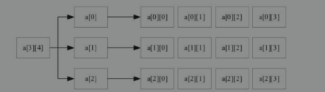
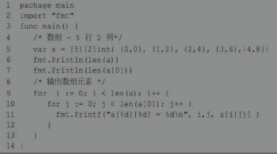
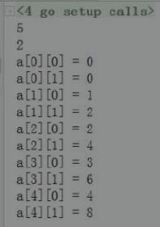
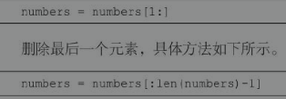
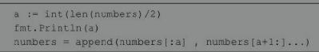

## 

### 5 Go语言的内置容器

### 5.1 数组

#### 数组的概念

数组是相同类型的一组数据构成的长度固定的序列，其中数据类型包含了基本数据类型、复合数据类型和自定义类型。数组中的每一项被称为数组的元素。数组名是数组的唯一标识符，数组的每一个元素都是没有名字的，只能通过索引下标（位置）进行访问。

因为数组的内存是一段连续的存储区域，所以数组的检索速度是非常快的；

但是数组也有一定的缺陷，就是定义后长度不能更改。

#### 数组的语法

Go语言数组声明需要指定元素类型及元素个数，语法格式如下。

```c++
var 变量名 [数组长度] 数据类型
```

以上为一维数组的定义方式，数组长度必须是整数且大于0，未初始化的数组不是nil，也就是说没有空数组（与切片不同）。

初始化数组语法格式如下。

```c++
var nums = [5]{1,2,3,4,5}
```

初始化数组中 {} 中的元素个数不能大于 [] 中的数字。

**如果忽略 [] 中的数字，不设置数组长度，Go语言会根据元素的个数来设置数组的长度。可以忽略声明中数组的长度并将其替换为“…”。编译器会自动计算长度。语法格式如下。**

```c++
var nums = [...]int{1,2,3,4,5,6}
```

修改数组内容，语法格式如下:

```c++
nums[4] = 23
```

以上实例读取数组第5个元素。数组元素可以通过索引（位置）来读取（或者修改），索引从0开始，第1个元素索引为0，第2个索引为1，以此类推。

#### 数组的长度

数组的长度是数组的一个内置常量，通过将数组作为参数传递给 len()函数，可以获得数组的长度。忽略声明中数组的长度并将其替换为“…”，编译器可以找到长度。接下来使用案例演示获取数组长度的方式：

```c++
package main
import "fmt"
func main(){
    a := [4]int64{12,22,33,55}
    b := [...]float64{23.3,22,23.123,12.123}
    fmt.Printf("len_a:%d,len_b:%d \n",len(a),len(b)) //len_a:4,len_b:4 
}
```

#### 遍历数组

```c++
package main

import "fmt"

func main(){
    a := [4]int64{12,22,33,55}
    //b := [...]float64{23.3,22,23.123,12.123}
    // 遍历方式1
    for i:= 0;i<len(a);i++{
        fmt.Printf("%d ",a[i])
    }
    fmt.Println()
    // 遍历方式2
    for _, value := range a{
        fmt.Printf("%d ",value)
    }
}
```

#### 多维数组——主要是二维数组

由于数据的复杂程度不一样，数组可能有多个下标。一般将数组元素下标的个数称为维数，根据维数，可将数组分为一维数组、二维数组、三维数组、四维数组等。二维及以上的数组可称为多维数组。

Go语言的多维数组声明方式：

```c++
var variable_name [SIZE1][SIZE2]...[SIZEn] variable_type
```

##### 二维数组

在实际的工作中，仅仅使用一维数组是远远不够的，例如，一个学习小组有10个人，每个人有3门课的考试成绩，如果使用一维数组解决是很麻烦的。这时，可以使用二维数组。

二维数组是最简单的多维数组，二维数组的本质也是一个一维数组，只是数组成员由基本数据类型变成了构造数据类型（一维数组）。

二维数组的定义方式如下。

```c++
var arrayName [x][y] variable_type
```

二维数组初始化，语法格式如下:

```c++
a = [3][4]int{
  {0,1,2,3}, // 第一行索引为0
  {4,5,6,7}, // 第二行索引为1
  {8,9,10,11} // 第三行索引为2
}
```

上述定义的二维数组共包含3×4个元素，即12个元素。接下来，我们通过一张图来描述二维数组a的元素分布情况，如图5.3所示。



二维数组元素通过指定坐标来访问，如数组中的行索引与列索引。语法格式如下。

```c++
int val = a[2][3]
```

以上实例访问了二维数组val第3行的第4个元素。

二维数组可以使用循环嵌套来输出元素，具体语法通过案例演示



结果如下：



#### 数组是值类型

Go语言中的数组并非引用类型，而是值类型。

当它们被分配给一个新变量时，会将原始数组复制出一份分配给新变量。

**因此对新变量进行更改，原始数组不会有反应。**

```c++
package main
import "fmt"
func main(){
    a := [...]string{"USA","China","India","Germany"}
    b := a // 将a赋值给b
    b[0] = "Singapore"
    fmt.Println("a>>>",a) // [USA China India Germany]
    fmt.Println("b>>>",b) // [Singapore China India Germany]
}
```

**注意：将数组作为函数参数进行传递，它们将通过值传递，原始数组依然保持不变。**

### 5.2 切片***

#### 切片的概念

Go语言中数组的长度不可改变，但在很多应用场景中，在初始定义数组时，数组的长度并不可预知，这样的序列集合无法满足要求。Go中提供了另外一种内置类型“切片（slice）”，弥补了数组的缺陷。切片是可变长度的序列，序列中每个元素都是相同的类型。切片的语法和数组很像。

从底层来看，切片引用了数组的对象。切片可以追加元素，在追加时可能使切片的容量增大。与数组相比，切片不需要设定长度，在[]中不用设定值，相对来说比较自由。

切片的数据结构可理解为一个结构体，这个结构体包含了三个元素。

- 指针，指向数组中切片指定的开始位置。
- 长度，即切片的长度。
- 容量，也就是切片开始位置到数组的最后位置的长度。

#### 切片的语法

##### 1. 声明切片

声明一个未指定长度的数组来定义切片，具体示例如下：

```c++
var indentifier []type
```

切片不需要说明长度。采用该声明方式且未初始化的切片为空切片。该切片默认为nil，长度为0。

**使用make()函数来创建切片，语法格式如下:**

```c++
var slice1 []type make([]type,len)
```

**使用make()函数来创建切片可以简写为如下格式:**

```c++
slice1 := make([]type,len)
```

创建切片时可以指定容量，其中capacity为可选参数：make([]T, length,capacity)。详情如下：

```c++
package main
import "fmt"
func main(){
    var nums = make([]int,3,5)
    fmt.Printf("%T\n",nums)//[]int
    fmt.Printf("len=%d cap=%d slice=%v\n",len(nums),cap(nums),nums)
    //len=3 cap=5 slice=[0 0 0]
}
```

##### 2. 初始化

（1）直接初始化切片，语法格式如下：

```c++
s := [] int {1,2,3}
```

（2）通过数组截取来初始化切片，语法格式如下:

```c++
arr := [5]int {1,2,3,4,5}
s := arr[:]
```

切片中包含数组所有元素，语法格式如下。

```c++
s := arr[startIndex : endIndex]
```

将arr中从下标startIndex到endIndex-1下的元素创建为一个新的切片（前闭后开），长度为endIndex-startIndex。

缺省endIndex时表示一直到arr的最后一个元素，语法格式如下。

```c++
s := arr[startIndex:]
```

缺省startIndex时表示从arr的第一个元素开始，语法格式如下。

```c++
s := arr[:endIndex]
```

（3）通过切片截取来初始化切片。

可以通过设置下限及上限来设置截取切片：[lower-bound:upper-bound]:

```c++
package main
import "fmt"
func main(){
    // 创建切片
    nums := []int{0,1,2,3,4,5,6,7,8,9}
    printSlice(nums) //len=10,cap=10,slice=[0 1 2 3 4 5 6 7 8 9]

    // 从索引1(包含)到4(不包含)
    fmt.Println("1->4:::",nums[1:4]) //1->4::: [1 2 3]

    // 使用切片初始化
    nums1 := nums[1:4]
    printSlice(nums1)//len=3,cap=9,slice=[1 2 3]
}

func printSlice(x []int){
    fmt.Printf("len=%d,cap=%d,slice=%v\n",len(x),cap(x),x)
}
```

#### Len()和cap()函数

切片的长度是切片中元素的数量。**切片的容量是从创建切片的索引开始的底层数组中元素的数量。**

切片可以通过len()方法获取长度，可以通过cap()方法获取容量。数组计算cap()结果与len()相同。

### 切片是引用类型 ***

**切片没有自己的任何数据。它只是底层数组的一个引用。对切片所做的任何修改都将反映在底层数组中。数组是值类型，而切片是引用类型，两者的区别如下例所示：**

```c++
package main

import "fmt"

func main(){
    a := [4]float64{56.1,22.2,33.12,55.45}
    b := []int{2,3,5}
    fmt.Printf("变量a —— 地址：%p，类型：%T，数值：%v，长度：%d\n",&a,a,a,len(a))
    fmt.Printf("变量b —— 地址：%p，类型：%T，数值：%v，长度：%d\n",&b,b,b,len(b))
    c := a
    d := b
    fmt.Printf("变量c —— 地址：%p，类型：%T，数值：%v，长度：%d\n",&c,c,c,len(c))
    fmt.Printf("变量d —— 地址：%p，类型：%T，数值：%v，长度：%d\n",&d,d,d,len(d))

    c[1] = 666
    fmt.Println("a=",a,"c=",c) // a= [56.1 22.2 33.12 55.45] c= [56.1 666 33.12 55.45]

    // 因为切片是引用类型（跟Python一样！）所以改变d的话同时会影响b中的数据！！！
    d[1] = 999
    fmt.Println("b=",b,"d=",d) // b= [2 999 5] d= [2 999 5]
}
```

#### append()和copy()函数

**两个方法不适用于数组。**

函数append()用于往切片中追加新元素，可以向切片里面追加一个或者多个元素，也可以追加一个切片。append()会改变切片所引用的数组的内容，从而影响到引用同一数组的其他切片。当使用append()追加元素到切片时，如果容量不够（也就是(cap-len) == 0），Go就会创建一个新的内存地址来储存元素。

函数copy()会复制切片元素，将源切片中的元素复制到目标切片中，返回复制的元素的个数。 copy()方法不会建立源切片与目标切片之间的联系。**也就是两个切片不存在联系，其中一个修改不影响另一个。**

**删除第一个或最后一个元素的方法：**



**删除中间元素的方法：**



### append()与copy()的对比案例一***

```c++
package main

import "fmt"

// 输出切片格式化信息
func printSlices(name string,x []int){
    fmt.Print(name,"\t")
    fmt.Printf("addr:%p len=%d cap=%d slice=%v \n",x,len(x),cap(x),x)
}

func main(){
    fmt.Println("1. ----------------------------")
    numbers := make([]int, 0, 20)
    printSlices("numbers",numbers) //numbers addr:0xc00006e000 len=0 cap=20 slice=[]
    //append
    numbers = append(numbers,0,1)
    printSlices("numbers",numbers) //numbers addr:0xc00006e000 len=2 cap=20 slice=[0 1]
    fmt.Println("2. ----------------------------")
    //追加一个切片
    s1 := []int{100,200,300,400,500}
    numbers = append(numbers,s1...)
    printSlices("numbers",numbers) // numbers addr:0xc000134000 len=7 cap=20 slice=[0 1 100 200 300 400 500]
    fmt.Println("3. ----------------------------")
    // 切片删除元素
    // 删除第一个元素
    numbers = numbers[1:]
    // 删除最后一个元素
    numbers = numbers[:len(numbers)-1]
    // 删除中间元素
    a := int(len(numbers)/2) // 中间数
    numbers = append(numbers[:a],numbers[a+1:]...)
    fmt.Println("4. ----------------------------")

    // 创建切片 mumbers1 是之前切片的两倍容量
    numbers1 := make([]int,len(numbers),(cap(numbers))*2)
    // 复制numbers的内容到numbers1 —— count是复制的个数
    count := copy(numbers1,numbers)
    fmt.Println("复制的个数：",count) // 4
    printSlices("numbers1",numbers1)//numbers1   addr:0xc000070000 len=4 cap=38 slice=[1 100 300 400]

    /*
    numbers1与numbers两者不存在联系，更改numbers的值不会影响numbers1！
    说明copy方法是不会建立两个切片的联系的！
    */
    numbers[0] = 666
    numbers1[0] = 888
    printSlices("numbers",numbers)//numbers addr:0xc000134008 len=4 cap=19 slice=[666 100 300 400]
    printSlices("numbers1",numbers1)//numbers1   addr:0xc000136000 len=4 cap=38 slice=[888 100 300 400]
}
```

### append()与copy()的对比案例二***

```c++
package main

import (
    "fmt"
    "strconv"
)

// 输出切片格式化信息
func printSlices(name string,x []string){
    fmt.Print(name," ")
    fmt.Printf("addr:%p len=%d cap=%d slice=%v \n",x,len(x),cap(x),x)
}

func main(){
    // 思考：使用那种初始化切片的方式更高效？
    var sa []string
    //sa := make([]string,0,10)
    printSlices("sa",sa)

    // 当使用append追加元素到切片时，如果容量不够，Go会创建一个新的切片变量来存储元素
    for i := 0; i < 10; i++{
        sa = append(sa,strconv.Itoa(i))
        printSlices("sa",sa)
    }
    printSlices("sa",sa)
}
// 可以看到容量cap的值在增加！
/*
sa addr:0x0 len=0 cap=0 slice=[]
sa addr:0xc00008e1f0 len=1 cap=1 slice=[0]
sa addr:0xc0000a6060 len=2 cap=2 slice=[0 1]
sa addr:0xc0000b2040 len=3 cap=4 slice=[0 1 2]
sa addr:0xc0000b2040 len=4 cap=4 slice=[0 1 2 3]
sa addr:0xc0000bc000 len=5 cap=8 slice=[0 1 2 3 4]
sa addr:0xc0000bc000 len=6 cap=8 slice=[0 1 2 3 4 5]
sa addr:0xc0000bc000 len=7 cap=8 slice=[0 1 2 3 4 5 6]
sa addr:0xc0000bc000 len=8 cap=8 slice=[0 1 2 3 4 5 6 7]
sa addr:0xc0000be000 len=9 cap=16 slice=[0 1 2 3 4 5 6 7 8]
sa addr:0xc0000be000 len=10 cap=16 slice=[0 1 2 3 4 5 6 7 8 9]
sa addr:0xc0000be000 len=10 cap=16 slice=[0 1 2 3 4 5 6 7 8 9]
*/
```

### 5.3 map

**map的概念**

Go 语言提供了内置类型 map，它将一个值与一个键关联起来，可以使用相应的键检索值。这种结构在其他资料中译成地图、映射或字典，但是在Go语言中习惯上翻译成集合。map正如现实生活中的字典一样，使用词-语义进行数据的构建，其中词对应键（key），语义对应值（value），即键与值构成映射的关系，通常将两者称为键值对，这样通过键可以快速找到对应的值。map是一种集合，可以像遍历数组或切片那样去遍历它。因为map是由Hash表实现的，所以对map的读取顺序不固定。

map是无序的，每次打印出来的map都会不一样，它不能通过index获取，而必须通过key获取。

map的长度是不固定的，和切片一样可以扩展。内置的len()函数同样适用于map，返回map拥有的键值对的数量。

**但是map不能通过cap()函数计算容量（或者说cap()函数的参数不可以是map）。**

同一个map中key必须保证唯一。**key的数据类型必须是可参与比较运算的类型**，也就是支持==或!=操作的类型，**如布尔型、整型、浮点型、字符串、数组。切片、函数等引用类型则不能作为key的数据类型**。

**map的value可以是任何数据类型。map和切片一样，也是一种引用类型。**

### map的语法 ***

#### map的声明

可以使用var关键字来定义map，也可以使用内建函数make()。

（1）使用var关键字定义map

```c++
var 变量名 map[key类型] value类型
```

**使用var关键字声明map，未初始化的map的默认值是nil。**

**nil map不能存放键值对。如果要使用map存储键值对，必须在声明时初始化，或者使用make()函数分配到内存空间。**

（2）使用make()函数

```c++
变量名 := make(map[key类型]value类型)
```

该声明方式，如果不初始化map，map也不等于nil。

#### map的初始化赋值和遍历

```c++
package main

import (
    "fmt"
)

func main(){
    // 1. 声明时同时初始化
    var country = map[string]string{
        "China":"Beijing",
        "Japan":"Tokyo",
        "USA":"DC",
    }
    fmt.Println(country) // map[China:Beijing Japan:Tokyo USA:DC]

    // 短变量声明初始化方式
    fating := map[string]float64{
        "a":12.23,
        "b":22.24,
        "c":34.21,
    }
    fmt.Println(fating) // map[a:12.23 b:22.24 c:34.21]

    // 2. 创建map后再赋值
    countryMap := make(map[string]string)
    countryMap["China"] = "Beijing"
    countryMap["Japan"] = "Tokyo"
    countryMap["France"] = "paris"
    fmt.Println(countryMap) // map[China:Beijing France:paris Japan:Tokyo]

    // 3. 遍历map（无序）
    // （1）key、value都遍历
    for k, v := range countryMap{
        fmt.Println("国家：",k," 首都：",v)
    }
    /*
    国家： China  首都： Beijing
    国家： Japan  首都： Tokyo
    国家： France  首都： paris
    */
    // (2) 只展示key
    for k := range countryMap{
        fmt.Println(k)
    }
    // （3）只展示value
    for _, value := range countryMap{
        fmt.Println(value)
    }
}
```

#### 查看元素是否在map中 ***

**可以通过key获取map中对应的value值。语法为：map[key]。当key不存在时，会得到该value值类型的默认值，比如string类型得到空字符串，int类型得到0，程序不会报错。**

**所以可以通过value, ok := map[key]获知key/value是否存在。ok是bool型，如果ok是true，则该键值对存在，否则不存在。**

```c++
package main

import (
    "fmt"
)

func main(){

    var country = map[string]string{
        "China":"Beijing",
        "Japan":"Tokyo",
        "USA":"DC",
    }
    fmt.Println(country) // map[China:Beijing Japan:Tokyo USA:DC]
    // 查看元素是否在map中
    query_str := "China"
    value, ok := country[query_str]
    fmt.Printf("%q\n",value) // ""
    fmt.Printf("%T , %v\n",ok,ok) //bool , false
    if ok{
        fmt.Println("找到了！")
    }else{
        fmt.Println("没找到！")
    }

    // 或者
    if value, ok := country[query_str];ok{
        fmt.Println("找到了！，首都：",value)
    }else{
        fmt.Println("没得！")
    }
}
```

#### delete()函数

delete(map, key) 函数用于删除集合的某个元素，参数为map和其对应的key。删除函数不返回任何值。

```c++
package main

import (
    "fmt"
)

func main(){

    var country = map[string]string{
        "China":"Beijing",
        "Japan":"Tokyo",
        "USA":"DC",
    }
    fmt.Println(country) // map[China:Beijing Japan:Tokyo USA:DC]

    // 根据key删除map中的某个元素
    fmt.Println("删除前：",country) //删除前： map[China:Beijing Japan:Tokyo USA:DC]
    if _,ok := country["Japan"];ok{
        delete(country,"China")
    }
    fmt.Println("删除后：",country) //删除后： map[Japan:Tokyo USA:DC]

    // 清空map
    country = make(map[string]string)
    fmt.Println("清空后：",country) //清空后： map[]
}
```

**Go语言没有为map提供清空所有元素的函数，清空map的唯一办法是重新make一个新的map。不用担心垃圾回收的效率，Go语言的垃圾回收比写一个清空函数更高效。**

#### map是引用类型

map与切片相似，都是引用类型。

**将一个map赋值给一个新的变量时，它们指向同一块内存（底层数据结构）。因此，修改两个变量的内容都能够引起它们所指向的数据发生变化。**

```c++
package main

import (
    "fmt"
)

func main(){

    var country = map[string]string{
        "China":"Beijing",
        "Japan":"Tokyo",
        "USA":"DC",
    }
    fmt.Println(country) // map[China:Beijing Japan:Tokyo USA:DC]

    newCountry := country
    newCountry["USA"]  = "CCCCCC"
    fmt.Println(country) // map[China:Beijing Japan:Tokyo USA:CCCCCC]
    fmt.Println(newCountry) // map[China:Beijing Japan:Tokyo USA:CCCCCC]
}
```


