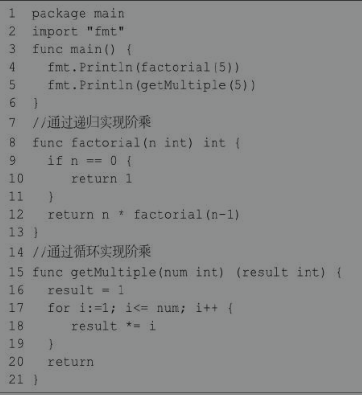
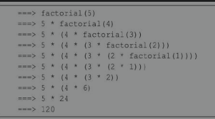
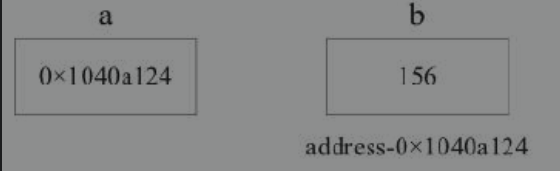
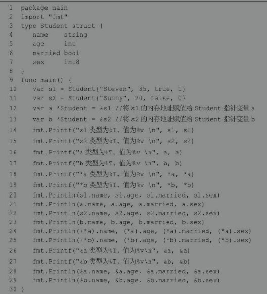
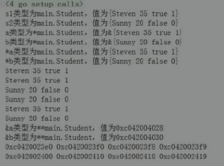
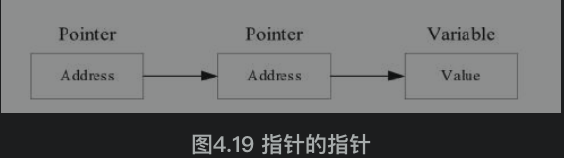

## 4 Go语言的函数与指针

### 4.1 函数 ***

Go 语言从设计上对函数进行了优化和改进，让函数使用起来更加方便。

因为Go语言的函数本身可以作为值进行传递，既支持匿名函数和闭包，又能满足接口，所以 Go 语言的函数属于一等公民。

#### 函数声明

普通函数需要先声明才能调用，一个函数的声明包括参数和函数名等。编译器通过声明才能了解函数应该怎样在调用代码和函数体之间传入参数和返回参数。语法格式如下所示：

```go
func 函数名(参数列表)(返回参数列表){
  // 函数体
}

func funcName(param1 type1, param2 type2,...)(output1 type1, output2 type2,...){
  // 逻辑代码
  // 返回多个值
  return value1, value2,...
}
```

##### 1. 函数定义解析

func：函数关键字。函数由func开始声明。

**funcName**：函数名。函数名和参数列表一起构成了函数签名。函数名由字母、数字和下画线组成。函数名的第一个字母不能为数字。在同一个包内，函数不能重名。

**param type**：参数列表。定义函数时的参数叫作形式参数，形参变量是函数的局部变量；函数被调用时，可以将值传递给参数，这个值被称为实际参数。参数列表指定的是参数类型、顺序及参数个数。参数是可选的，也就是说函数可以不包含参数。

**output1 type1, output2 type2**：返回值列表。返回值返回函数的结果，结束函数的执行。

- Go语言的函数可以返回多个值。
- 返回值可以是返回数据的数据类型，也可以是变量名+变量类型的组合。
- 函数声明时有返回值，必须在函数体中使用return语句提供返回值列表。
- 如果只有一个返回值并且没有声明返回值变量，那么可以省略包括返回值的括号。
- return后的数据，要保持和声明的返回值类型、数量、顺序一致。
- 如果函数没有声明返回值，函数中也可以使用return关键字，用于强制结束函数。

**函数体**：函数定义的代码集合，是能够被重复调用的代码片段。

##### 2. 参数类型简写

在参数列表中，如果有多个参数变量，则以逗号分隔；如果相邻变量是同类型，则可以将类型省略。语法格式如下所示：

```go
func add (a,b int){}
```

**go语言的函数支持可变参数。接受变参的函数有着不定数量的参数，语法结构如下：**

```go
func myfunc(arg ...int){}
```

**arg ...int告诉Go这个函数接受不定数量的参数。**

**注意，这些参数的类型全部是int。在函数体中，变量arg是一个int的slice（切片）。**

#### 变量作用域

作用域是变量、常量、类型、函数的作用范围。

在函数体内声明的变量称为局部变量，它们的作用域只在函数体内，生命周期同所在的函数。参数和返回值变量也是局部变量。

在函数体外声明的变量称为全局变量，全局变量可以在整个包甚至外部包（被导出后）使用。全局变量的生命周期同main()。

全局变量可以在任何函数中使用。Go语言程序中全局变量与局部变量名称可以相同，但是函数内的局部变量会被优先考虑。

函数中定义的参数称为形式参数，形式参数会作为函数的局部变量来使用。

为了让大家更直观地理解作用域，下面通过一个案例加以分析：

```go
package main
import "fmt"
// 声明全局变量
var a1 int = 7
var b1 int = 9

// 两数相加的函数
func sum(a1, b1 int)(c1 int){
    a1 ++
    b1 += 2
    c1 = a1 + b1
    fmt.Printf("sum函数中的 a1=%d\n", a1) //11
    fmt.Printf("sum函数中的 b1=%d\n", b1) //22
    fmt.Printf("sum函数中的 c1=%d\n", c1) //33
    return c1
}

func main() {
    // main 函数中声明局部变量
    a1, b1, c1 := 10, 20, 0
    // 局部作用域优先用局部作用域的变量
    fmt.Printf("main函数中 a1=%d\n", a1) // 10
    fmt.Printf("main函数中 b1=%d\n", b1) // 20
    fmt.Printf("main函数中 c1=%d\n", c1) // 0

    c1 = sum(a1,b1)
    fmt.Printf("main函数中的 c1变成了:%d",c1) //33
}
```

**运行结果可以看出，同样变量名的局部变量和全局变量，同一作用域内优先使用局部变量，正所谓“强龙不压地头蛇”。**

#### 函数变量(函数作为值)***

在Go语言中，函数也是一种类型，可以和其他类型（如int32、float等等）一样被保存在变量中。

**在Go语言中可以通过type来定义一个自定义类型。函数的参数完全相同（包括参数类型、个数、顺序），函数返回值相同。**

##### 函数变量案例一

```go
package main
import (
    "fmt"
    "strings"
)
func main() {
    result := StringToLower("ADSDFDSKJLkjklsdUOSDFSDF",processCase) // 7行
    fmt.Println(result) //AdSdFdSkJlKjKlSdUoSdFsDf
    result = StringToLower2("ADSDFDSKJLkjklsdUOSDFSDF",processCase)
    fmt.Println(result) //AdSdFdSkJlKjKlSdUoSdFsDf
}
// 处理字符串，奇数偶数依次显示为大小写
func processCase(str string) string{ // 13行
    ret := ""
    for i,value := range str{
        if i%2 ==0{
            ret += strings.ToUpper(string(value))
        }else{
            ret += strings.ToLower(string(value))
        }
    }
    return ret
}
func StringToLower(str string, f func(string) string) string{ // 24行
    fmt.Printf("StringToLower>>> %T \n",f) //func(string) string
    return f(str)
}
type caseFunc func(string) string // 28行:声明了一个函数类型，通过type关键字，caseFunc会形成一种新的类型
func StringToLower2(str string, f caseFunc) string{
    // 打印变量f的类型
    fmt.Printf("StringToLower2>>> %T \n",f) //main.caseFunc
    return f(str)
}
```

**在上例中，第24行声明了函数StringToLower()，第二个传入参数为一个函数类型变量f。第7行调用了函数StringToLower()，第二个参数传入了在第13行声明的函数processCase()。这样在函数StringToLower()中可以通过函数变量f执行函数processCase()。第28行将参数相同的函数类型声明为新的类型caseFunc，那么caseFunc就代表着这一种函数变量使用在StringToLower2()中。**

##### 函数变量案例二

```go
package main

import "fmt"

type processFunc func(int) bool // 声明了一个函数类型

func main() {
    slice := []int{1, 2, 3, 4, 5, 7}
    fmt.Println("slice = ",slice)
    odd := filter(slice, isOdd) // 函数当作值来传递
    fmt.Println("奇数元素:", odd)
    even := filter(slice, isEven) // 函数当作值传递
    fmt.Println("偶数元素:", even)
}
//判断元素是否是偶数
func isEven(integer int) bool{
    if integer%2 == 0{
        return true
    }
    return false
}
//判断元素是否是奇数
func isOdd(integer int) bool{
    if integer%2 == 0{
        return false
    }
    return true
}
//根据函数来处理切片，根据元素的奇数偶数分组，返回新的切片
func filter(slice []int, f processFunc) []int{
    var ret []int
    for _, value := range(slice){
        if f(value){
            ret = append(ret,value)
        }
    }
    return ret
}
/*
slice =  [1 2 3 4 5 7]
奇数元素: [1 3 5 7]
偶数元素: [2 4]
*/
```

函数变量的使用步骤及意义如下:

- 定义一个函数类型。
- 实现定义的函数类型。
- 作为参数调用。

函数变量的用法类似接口的用法。

函数当作值和类型在写一些通用接口的时候非常有用，通过上面的例子可以看到processFunc这个类型是一个函数类型，然后两个filter函数的参数和返回值与processFunc类型是一样的。用户可以实现很多种逻辑，这样使得程序变得非常灵活。

### 4.2 匿名函数 ***

Go语言支持匿名函数，即在需要使用函数时再定义函数。匿名函数没有函数名，只有函数体，函数可以作为一种类型被赋值给变量，**匿名函数也往往以变量方式被传递**。

**匿名函数经常被用于实现回调函数、闭包等。**语法格式如下所示：

```go
func(参数列表)(返回参数列表){
  // 函数体
}
```

##### 1. 在定义时调用匿名函数

```go
package main
import "fmt"
func main(){
    func(data int){
        fmt.Println("hello!",data)
    }(250)
}
//hello! 250
```

##### 2. 将匿名函数赋值给变量

```go
package main
import "fmt"
func main(){
    f := func(data string){
        fmt.Println(data)
    }
    f("火影whw")
}
//火影whw
```

##### 3. 匿名函数用作回调函数 ***

```go
package main

import (
    "fmt"
    "math"
)

func main(){
    // 调用函数，对每个元素进行求平方根的操作
    arr := []float64{1,9,16,25,33}
    visit(arr, func(v float64){
        v = math.Sqrt(v)
        fmt.Printf("平方根:%.2f ",v)
    })
    println()
    // 调用函数，对每个元素进行求平方操作
    visit(arr, func(v float64){
        v = math.Pow(v,2)
        fmt.Printf("平方:%.0f ", v)
    })
}
// 定义一个函数，遍历切片元素，对每个元素进行处理
func visit(lst []float64, f func(float64)){
    for _, value := range lst{
        f(value)
    }
}
/*
平方根:1.00 平方根:3.00 平方根:4.00 平方根:5.00 平方根:5.74
平方:1 平方:81 平方:256 平方:625 平方:1089
*/
```

## 6 闭包closure ***

### 1. 闭包的概念

闭包并不是什么新奇的概念，它早在高级语言开始发展的年代就产生了。闭包（Closure）是词法闭包（Lexical Closure）的简称。

**闭包是由函数和与其相关的引用环境组合而成的实体。在实现深约束时，需要创建一个能显式表示引用环境的东西，并将它与相关的子程序捆绑在一起，这样捆绑起来的整体被称为闭包。函数 + 引用环境 = 闭包。**

闭包只是在形式和表现上像函数，但实际上不是函数。函数是一些可执行的代码，这些代码在函数被定义后就确定了，不会在执行时发生变化，所以一个函数只有一个实例。

闭包在运行时可以有多个实例，不同的引用环境和相同的函数组合可以产生不同的实例。

**闭包在某些编程语言中被称为Lambda表达式。**

函数本身不存储任何信息，只有与引用环境结合后形成的闭包才具有“记忆性”。函数是编译器静态的概念，而闭包是运行期动态的概念。

**对象是附有行为的数据，而闭包是附有数据的行为。**

### 2. 闭包的优点

（1）加强模块化。闭包有益于模块化编程，便于以简单的方式开发较小的模块，从而提高开发速度和程序的可复用性。和没有使用闭包的程序相比，使用闭包可将模块划分得更小。

比如要计算一个数组中所有数字的和，只需要循环遍历数组，把遍历到的数字加起来就行了。如果现在要计算所有元素的积，又或者要打印所有的元素呢？解决这些问题都要对数组进行遍历，如果是在不支持闭包的语言中，程序员不得不一次又一次重复地写循环语句。而这在支持闭包的语言中是不必要的。这种处理方法多少有点像回调函数，不过要比回调函数写法更简单，功能更强大。

（2）抽象。闭包是数据和行为的组合，这使得闭包具有较好的抽象能力。

（3）简化代码。**一个编程语言需要以下特性来支持闭包：**

- 函数是一阶值（First-class value，一等公民），即函数可以作为另一个函数的返回值或参数，还可以作为一个变量的值。
- 函数可以嵌套定义，即在一个函数内部可以定义另一个函数。
- 允许定义匿名函数。
- 可以捕获引用环境，并把引用环境和函数代码组成一个可调用的实体。

**由于闭包函数“捕获”了和它在同一作用域的其他常量和变量，所以当闭包在任何地方被调用，闭包都可以使用这些常量或者变量。它不关心这些变量是否已经超出作用域，只要闭包还在使用这些变量，这些变量就依然存在。**

**没有使用闭包进行计数的代码：**

```go
package main
import "fmt"
func main(){
    for i:=0;i<5;i++{
        fmt.Printf("i=%d ",i)
        fmt.Println(add2(i))
    }
}
func add2(x int) int{
    sum := 0
    sum += x
    return x
}
// for循环每执行一次，sum都会清零，没有实现sum累加计数。
/*
i=0 0
i=1 1
i=2 2
i=3 3
i=4 4
*/
```

### 3.闭包实现计数及说明

```go
package main
import "fmt"
func main(){
    pos := adder()
    for i := 0;i<=5;i++{
        fmt.Printf("i=%d ",i)
        fmt.Println(pos(i))
    }
    fmt.Println("------------------继续在之前的基础上累和-----------------")
    for i := 0;i<=5;i++{
        fmt.Printf("i=%d ",i)
        fmt.Println(pos(i))
    }
}

// 这里的 adder是一个函数 —— 返回的类型是 func(int) int 
func adder() func(int) int{
    sum := 0
  // 返回的是一个匿名函数
    return func(x int) int{
        fmt.Printf("sum1=%d ",sum)
        sum += x
        fmt.Printf("sum2=%d ",sum)
        return sum
    }
}
/*
i=0 sum1=0 sum2=0 0
i=1 sum1=0 sum2=1 1
i=2 sum1=1 sum2=3 3
i=3 sum1=3 sum2=6 6
i=4 sum1=6 sum2=10 10
i=5 sum1=10 sum2=15 15
------------------继续在之前的基础上累和-----------------
i=0 sum1=15 sum2=15 15
i=1 sum1=15 sum2=16 16
i=2 sum1=16 sum2=18 18
i=3 sum1=18 sum2=21 21
i=4 sum1=21 sum2=25 25
i=5 sum1=25 sum2=30 30
*/
```

（1）这里的 adder是一个函数 —— 返回的类型是 func(int) int！

（2）adder函数返回的是一个匿名函数，但是这个匿名函数引用到函数外的sum，因此这个匿名函数就和sum形成一个整体，构成闭包。

（3）当我们反复调用pos函数的时候，因为sum是初始化一次，因此每次调用都会进行累计。

**（4）我们要搞清楚闭包的关键，就要分析出返回的函数它使用(引用)到哪些变量，因为函数和它引用到的变量共同构成闭包**

### 4.闭包的最佳实践1

```go
package main
import "fmt"
func main(){
    myfunc := Counter()
    fmt.Println("myfunc",myfunc)//myfunc 0x109f170
    // 调用 myfunc函数，i变量自增1并返回
    fmt.Println(myfunc())//1
    fmt.Println(myfunc())//2
    fmt.Println(myfunc())//3
    // 创建新的函数 nextNumber1，并查看结果
    myfunc1 := Counter()
    fmt.Println("myfunc1>>",myfunc1)//0x109f180
    fmt.Println("myfunc1的ret>>",myfunc1()) //1
    fmt.Println("myfunc1的ret>>",myfunc1()) //2
}
// 计数器，闭包函数
func Counter() func() int{
    i := 0
    res := func() int{
        i += 1
        return i
    }
    fmt.Printf("%T, %v \n", res, res) //func() int, 0x109f170
    fmt.Println("Counter中的内部函数:",res) //Counter中的内部函数: 0x109f170
    return res
}
```

### 5.闭包的最佳实践2

要求：

```go
1、函数 makeSuffix(suffix string) 可以接受一个文件后缀(比如.jpg)，返回一个闭包。
2、调用闭包，可以传入一个文件名，如果该文件名没有指定后缀，就返回文件名.jpg，如果有后缀了就返回原文件。
3、strings.HasSuffix函数可以判断某个字符串是否有指定的后缀。
```

```go
package main

import (
    "fmt"
    "strings"
)

// 闭包的使用
func makeSuffix(suffix string) func(string) string{
    return func (name string) string{
        // 如果name没有后缀就加上，如果有就返回原来的名字
        if !strings.HasSuffix(name,suffix){
            return name + suffix
        }
        return name
    }
}

func main() {
    // 返回一个闭包
    f2 := makeSuffix(".mp4")
    fmt.Println("文件处理后：",f2("whw")) // whw.mp4
    fmt.Println("文件处理后：",f2("wanghw.mp4")) // wanghw.mp4
}
```

**上面代码的说明:**

（1）返回的匿名函数和 makeSuffix(suffix string)的 suffix 变量，组合成一个闭包，因为返回的函数引用到了suffix这个变量了！

（2）比传统方法的好处是：传统的方法需要每次都传入后缀名（比如.mp4），而闭包可以保留上次引用的某个值，所以我们传入一次即可反复使用！

## 7 可变参数

如果一个函数的参数，类型一致，但个数不定，可以使用函数的可变参数。语法格式如下所示

```go
func 函数名(参数名 ...类型)[返回值列表]{
  // 函数体
}
```

该语法格式定义了一个接受任何数目、任何类型参数的函数。

**这里特殊的语法是三个点“...”，**在一个变量后面加上三个点，表示从该处开始接受可变参数。

**当要传递若干个值到可变参数函数中时，可以手动书写每个参数，也可以将一个slice传递给该函数，通过“...”可以将slice中的参数对应地传递给函数。**

```go
package main

import "fmt"

func main(){
    sum, avg, count := GetScore(90,87,86,92)
    fmt.Printf("sum=%.2f, avg=%.2f, count=%d",sum,avg,count)//sum=355.00, avg=88.75, count=4
    fmt.Println()
    // 列表传不定参数，后面跟...
    scores := []float64{99,88,55,21.1,97,3}
    sum2, avg2, count2 := GetScore(scores...)
    fmt.Printf("sum=%.2f, avg=%.2f, count=%d",sum2,avg2,count2)//sum=363.10, avg=60.52, count=6
}

func GetScore(scores ...float64)(sum, avg float64,count int){
    for _,value := range scores{
        sum += value
        count ++
    }
    avg = sum / float64(count)
    return
}
```

使用可变参数应注意如下细节:

- 一个函数最多只能有一个可变参数。
- 若参数列表中还有其他类型参数，则可变参数写在所有参数的最后。

## 8 递归函数

在函数内部，可以调用其他函数。如果一个函数在内部调用自身，那么这个函数就是递归函数。递归函数必须满足以下两个条件。

（1）在每一次调用自己时，必须是（在某种意义上）更接近于解。

（2）必须有一个终止处理或计算的准则。

下面通过案例来理解递归函数的作用。

计算阶乘n!=1×2×3×...×n，用函数fact(n)表示，可以看出：fact(n)=n!=1×2×3×...×(n-1)×n=(n-1)!×n=fact(n-1)×n。所以，fact(n)可以表示为n×fact(n-1)，只有n=1时需要特殊处理。如例4-11所示。



递归的计算过程如下所示。



使用递归需要注意如下事项：

- 递归函数的优点是定义简单，逻辑清晰。理论上，所有的递归函数都可以用循环的方式实现，但循环的逻辑不如递归清晰。
- 使用递归函数需要注意防止栈溢出。在计算机中，函数调用是通过栈（stack）这种数据结构实现的，每当进入一个函数调用，栈就会加一层，每当函数返回，栈就会减一层。由于栈的大小不是无限的，所以，递归调用的次数过多，会导致栈溢出。
- 使用递归函数的优点是逻辑简单清晰，缺点是过深的调用会导致栈溢出。

## 9 指针

### 指针的概念

指针是存储另一个变量的内存地址的变量。变量是一种使用方便的占位符，**变量都指向计算机的内存地址**。

**一个指针变量可以指向任何一个值的内存地址。**

例如：变量b的值为156，存储在内存地址0x1040a124。变量a持有b的地址，则a被认为指向b。如图4.12所示。



**在Go语言中使用取地址符（＆）来获取变量的地址，一个变量前使用＆，会返回该变量的内存地址。**

```go
package main
import "fmt"
func main(){
    a := 10
    fmt.Printf("变量a的地址：%x\n",&a) // 变量a的地址：c00001e060
}
```

Go语言指针的特点如下:

- Go语言指针的最大特点是：指针不能运算（不同于C语言）。
- 在Go语言中如果对指针进行运算会报错！

### 声明指针

声明指针，*T是指针变量的类型，它指向T类型的值。

```go
var 指针变量名 *指针类型
```

*号用于指定变量是一个指针：

```go
var ip *int  // 指向整型的指针
var fp *float32 // 指向浮点型的指针
```

指针使用流程如下：

- 定义指针变量。
- 为指针变量赋值。
- 访问指针变量中指向地址的值。

**获取指针指向的变量值：在指针类型的变量前加上 * 号（前缀），如*a。**

### 指针示例一

```go
package main
import "fmt"
func main(){
    // 声明实际变量
    var a int = 120
    // 声明指针变量
    var ip *int
    // 给指针变量赋值，将变量a的地址赋值给ip
    ip = &a
    // 打印 a 的类型和值
    fmt.Printf("a的类型:%T,值是:%v \n",a,a)//a的类型:int,值是:120

    // 打印 &a 的类型与值
    fmt.Printf("&a的类型:%T,值是:%v \n",&a,&a)//&a的类型:*int,值是:0xc0000b4008

    // 打印 ip 的类型和值
    fmt.Printf("ip的类型:%T,值是:%v \n",ip,ip)//ip的类型:*int,值是:0xc0000b4008

    // 打印 *ip 的类型和值
    fmt.Printf("*ip的类型:%T,值是:%v \n",*ip,*ip)//*ip的类型:int,值是:120

    // 打印 *&a 的类型和值
    fmt.Printf("*&a的类型:%T,值是:%v \n",*&a,*&a)//*&a的类型:int,值是:120 
}
```

### **指针示例二**



结果如下：



### 空指针

在Go语言中，当一个指针被定义后没有分配到任何变量时，它的值为nil。nil指针也称为空指针。nil在概念上和其他语言的null、None、NULL一样，都指代零值或空值。

假设指针变量命名为ptr。空指针判断如下：

```go
if ptr != nil // ptr不是空指针
if ptr == nil // ptr是空指针
```

### 使用指针***

#### 1. 通过指针修改变量的数值

```go
package main
import "fmt"
func main(){
    b := 996
    a := &b
    fmt.Println("b的地址:",a)
    fmt.Println("*a的值:",*a)
    *a++
    fmt.Println("b的新值:",b)
}
/*
b的地址: 0xc0000b4008
*a的值: 996
b的新值: 997
*/
```

#### 2. 使用指针作为函数的参数

```go
package main

import "fmt"

func main(){
    a := 58
    fmt.Printf("%T \n",a) //int
    fmt.Printf("%x \n",&a)//c00012c008
    // b := &a
    var b *int = &a
    change(b)
    fmt.Println("函数调用之后的a的值:",a) //函数调用之后的a的值: 15
}
func change(val *int){
    *val = 15
}
```

**将基本数据类型的指针作为函数的参数，可以实现对传入数据的修改，这是因为指针作为函数的参数只是复制了一个指针，指针指向的内存没有发生改变。**

### 指针数组

指针数组：就是元素为指针类型的数组。

```go
var ptr [3]*string
```

**有一个元素个数与之相同的数组，将该数组中每个元素的地址赋值给该指针数组。也就是说该指针数组与某一个数组完全对应。可以通过*指针变量获取到该地址所对应的数值。**

```go
package main

import "fmt"

const COUNT int = 3

func main() {
    a := [COUNT]string{"abc", "ABC", "whw"}
    // 定义指针数组
    var ptr [COUNT]*string
    fmt.Printf("%T, %v \n", ptr, ptr) //[3]*string, [<nil> <nil> <nil>]
    for i := 0; i < COUNT; i++ {
        // 将数组中每个元素的地址赋值给指针数组
        ptr[i] = &a[i]
    }
    fmt.Printf("%T, %v \n", ptr, ptr) //[3]*string, [0xc000090180 0xc000090190 0xc0000901a0]
    // 获取指针数组中的第一个值，其实就是一个地址
    fmt.Println(ptr[0]) //0xc000090180
    // 根据数组元素的每个地址获取该地址所指向的元素的数值
    for i := 0; i < COUNT; i++ {
        fmt.Printf("a[%d]=%s \n", i, *ptr[i])
    }
    /*
        a[0]=abc
        a[1]=ABC
        a[2]=whw
    */
}
```

### 指针的指针

如果一个指针变量存放的又是另一个指针变量的地址，则称这个指针变量为指向指针的指针变量。当定义一个指向指针的指针变量时，第一个指针存放第二个指针的地址，第二个指针存放变量的地址，如图4.19所示。



指向指针的指针变量声明格式如下。

```go
var ptr **int
```

以上指向指针的指针变量为整型。

**访问指向指针的指针变量值需要使用两个 * 号。**

```go
package main
import "fmt"
func main(){
    var a string
    var ptr *string
    var pptr **string
    a = "火影whw"
    // 指针ptr地址
    ptr = &a
    fmt.Println("ptr>>>",ptr)//0xc0000901e0
    // pptr：指向指针ptr的指针
    pptr = &ptr
    fmt.Println("pptr>>>",pptr)//0xc0000b0018
    // 获取具体的值
    fmt.Printf("a=%v \n",a)
    fmt.Printf("*ptr=%v \n",*ptr)
    fmt.Printf("**pptr=%v \n",**pptr)
    /*
    a=火影whw
    *ptr=火影whw
    **pptr=火影whw
    */
}
```

