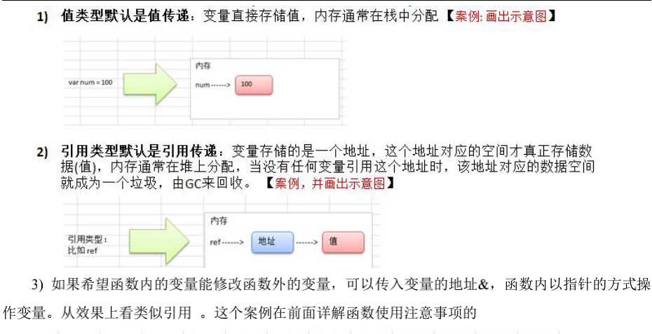
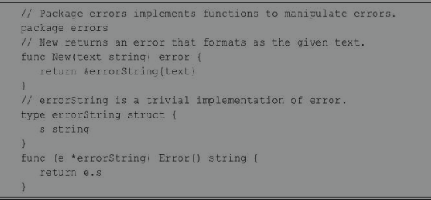
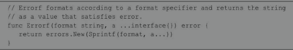

## 1 值类型与引用类型

### 值类型

**基本数据类型**（如：int系列、float系列、bool、string）；**数组**；**结构体**

### 引用类型

指针；**slice切片**；**map**；**管道chan**；**接口interface**

### 值传递与引用传递



## 2 函数的参数传递

函数如果使用参数，该参数变量称为函数的形参。形参就像定义在函数体内的局部变量。

**调用函数，可以通过两种方式来传递参数，即值传递和引用传递，或者叫作传值和传引用。**

### 值传递（传值）

**值传递是指在调用函数时将实际参数复制一份传递到函数中，这样在函数中如果对参数进行修改，将不会影响到原内容数据。**

默认情况下，Go语言使用的是值传递，即在调用过程中不会影响到原内容数据。

**每次调用函数，都将实参复制一份再传递到函数中。每次都复制一份，性能会下降，但是Go 语言中使用指针和值传递配合就避免了性能降低问题，也就是通过传指针参数来解决实参复制的问题。**

### 引用传递（传引用）

引用传递是指在调用函数时**将实际参数的地址传递到函数中**，**那么在函数中对参数所进行的修改，将影响到原内容数据。**

**严格来说Go语言只有值传递这一种传参方式，Go语言是没有引用传递的。**

**Go语言中可以借助传指针来实现引用传递的效果。函数参数使用指针参数，传参的时候其实是复制一份指针参数，也就是复制了一份变量地址。**

函数的参数如果是指针，当函数调用时，虽然参数仍然是按复制传递的，但是此时仅仅只是复制一个指针，也就是一个内存地址，这样就不用担心实参复制造成的内存浪费、时间开销、性能降低。

引用传递的作用如下：

- 传指针使得多个函数能操作同一个对象。
- 传指针更轻量级（8 bytes），只需要传内存地址。如果参数是非指针参数，那么值传递的过程中，每次在复制上面就会花费相对较多的系统开销（内存和时间）。所以要传递大的结构体的时候，用指针是一个明智的选择。

**Go语言中slice、map、chan类型的实现机制都类似指针，所以可以直接传递，而不必取地址后传递指针。**

### 函数传int类型的值与引用的对比：

```go
package main
import "fmt"
func main(){
    a := 10
    fmt.Printf("1. 变量a的内存地址:%p,值为%v \n",&a,a)
    fmt.Printf("======int型变量a的内存地址:%p \n",a)
    changeIntVal(a)
    fmt.Printf("2. changeIntVal函数之后,变量a的内存地址:%p,值为:%v \n",&a,a) // a还是10
    changeIntPtr(&a)
    fmt.Printf("3. changeIntPtr函数之后,变量a的内存地址:%p,值为:%v \n",&a,a) // a变成了50
}
//函数传int类型的值
func changeIntVal(a int){
    fmt.Printf("------changeIntVal函数内:值参数a的内存地址:%p,值为:%v\n",&a,a)
    // 改变a
    a = 90
}
//函数传引用
func changeIntPtr(a *int){
    fmt.Printf("------changeIntPtr函数内:指针参数a的内存地址:%p,值为:%v\n",&a,a)
    // 改变a
    *a = 50
}
/*
1. 变量a的内存地址:0xc0000b4008,值为10
======int型变量a的内存地址:%!p(int=10)
------changeIntVal函数内:值参数a的内存地址:0xc0000b4020,值为:10
2. changeIntVal函数之后,变量a的内存地址:0xc0000b4008,值为:10
------changeIntPtr函数内:指针参数a的内存地址:0xc0000ae020,值为:0xc0000b4008
3. changeIntPtr函数之后,变量a的内存地址:0xc0000b4008,值为:50
*/
```

### 函数传slice类型的值与引用的对比

```go
package main

import "fmt"

func main(){
    a := []int{1,2,3,4}
    fmt.Printf("1. 变量a的内存地址:%p,值为%v \n",&a,a)
    fmt.Printf("======int型变量a的内存地址:%p \n",a)
    changeIntVal(a)
    fmt.Printf("2. changeIntVal函数之后,变量a的内存地址:%p,值为:%v \n",&a,a) // a变成了[90 2 3 4]
    changeIntPtr(&a)
    fmt.Printf("3. changeIntPtr函数之后,变量a的内存地址:%p,值为:%v \n",&a,a) // a变成了[50 2 3 4] 
}
//函数传int类型的值
func changeIntVal(a []int){
    fmt.Printf("------changeIntVal函数内:值参数a的内存地址:%p,值为:%v\n",&a,a)
    // 改变a
    a[0] = 90
}
//函数传引用
func changeIntPtr(a *[]int){
    fmt.Printf("------changeIntPtr函数内:指针参数a的内存地址:%p,值为:%v\n",&a,a)
    // 改变a
    (*a)[0] = 50
}
/*
1. 变量a的内存地址:0xc00000c080,值为[1 2 3 4] 
======int型变量a的内存地址:0xc000018100 
------changeIntVal函数内:值参数a的内存地址:0xc00000c0e0,值为:[1 2 3 4]
2. changeIntVal函数之后,变量a的内存地址:0xc00000c080,值为:[90 2 3 4] 
------changeIntPtr函数内:指针参数a的内存地址:0xc00000e030,值为:&[90 2 3 4]
3. changeIntPtr函数之后,变量a的内存地址:0xc00000c080,值为:[50 2 3 4] 
*/
```

### 函数传数组，其类型的值与引用的对比

```go
package main

import "fmt"

func main(){
    a := [4]int{1,2,3,4}
    fmt.Printf("1. 变量a的内存地址:%p,值为%v \n",&a,a)
    fmt.Printf("======int型变量a的内存地址:%p \n",a)
    changeIntVal(a)
    fmt.Printf("2. changeIntVal函数之后,变量a的内存地址:%p,值为:%v \n",&a,a) // a没变 还是[1 2 3 4]
    changeIntPtr(&a)
    fmt.Printf("3. changeIntPtr函数之后,变量a的内存地址:%p,值为:%v \n",&a,a) // a变成了[50 2 3 4]
}
//函数传int类型的值
func changeIntVal(a [4]int){
    fmt.Printf("------changeIntVal函数内:值参数a的内存地址:%p,值为:%v\n",&a,a)
    // 改变a
    a[0] = 90
}
//函数传引用
func changeIntPtr(a *[4]int){
    fmt.Printf("------changeIntPtr函数内:指针参数a的内存地址:%p,值为:%v\n",&a,a)
    // 改变a
    (*a)[0] = 50
}
/*
1. 变量a的内存地址:0xc0000b8000,值为[1 2 3 4] 
======int型变量a的内存地址:%!p([4]int=[1 2 3 4]) 
------changeIntVal函数内:值参数a的内存地址:0xc0000b8080,值为:[1 2 3 4]
2. changeIntVal函数之后,变量a的内存地址:0xc0000b8000,值为:[1 2 3 4] 
------changeIntPtr函数内:指针参数a的内存地址:0xc0000ae020,值为:&[1 2 3 4]
3. changeIntPtr函数之后,变量a的内存地址:0xc0000b8000,值为:[50 2 3 4] 
*/
```

### 函数传结构体

```go
package main
import "fmt"
type Teacher struct{
    name string
    age int
    married bool
}

func main(){
    a := Teacher{"wanghe",22,false}
    fmt.Printf("1. 变量a的内存地址:%p,值为%v \n",&a,a)
    fmt.Printf("======int型变量a的内存地址:%p \n",a)
    changeIntVal(a)
    fmt.Printf("2. changeIntVal函数之后,变量a的内存地址:%p,值为:%v \n",&a,a) // a没变 还是{wanghe 22 false}
    changeIntPtr(&a)
    fmt.Printf("3. changeIntPtr函数之后,变量a的内存地址:%p,值为:%v \n",&a,a) // a变成了{sasuke 32 false}
}
//函数传int类型的值
func changeIntVal(a Teacher){
    fmt.Printf("------changeIntVal函数内:值参数a的内存地址:%p,值为:%v\n",&a,a)
    // 改变a
    a.name = "naruto"
    a.age = 23
}
//函数传引用
func changeIntPtr(a *Teacher){
    fmt.Printf("------changeIntPtr函数内:指针参数a的内存地址:%p,值为:%v\n",&a,a)
    // 改变a
    a.name = "sasuke"
    a.age = 32
}
/*
1. 变量a的内存地址:0xc00000c080,值为{wanghe 22 false}
======int型变量a的内存地址:%!p(main.Teacher={wanghe 22 false})
------changeIntVal函数内:值参数a的内存地址:0xc00000c0e0,值为:{wanghe 22 false}
2. changeIntVal函数之后,变量a的内存地址:0xc00000c080,值为:{wanghe 22 false}
------changeIntPtr函数内:指针参数a的内存地址:0xc00000e030,值为:&{wanghe 22 false}
3. changeIntPtr函数之后,变量a的内存地址:0xc00000c080,值为:{sasuke 32 false}
*/
```

### 值传递与引用传递的细节问题

Go语言中所有的传参都是值传递（传值），都是一个副本。

副本的内容有的是值类型（int、string、bool、array、struct属于值类型），这样在函数中就无法修改原内容数据；

有的是引用类型（pointer、 slice、map、chan属于引用类型），这样就可以修改原内容数据。

是否可以修改原内容数据，和传值、传引用没有必然的关系。在C++中，传引用肯定是可以修改原内容数据的；在Go语言里，虽然只有传值，但是也可以修改原内容数据，因为参数可以是引用类型。

传引用和引用类型是两个概念。虽然Go语言只有传值一种方式，但是可以通过传引用类型变量达到与传引用一样的效果。

## 3 Go语言异常处理 

为了保证程序的稳定性、可调试性，为了方便维护者阅读和理解，降低维护成本，Go语言提供了异常处理。

### 8.0 错误处理

**Go中引入的处理方式为：defer、panic、recover**

**简单描述：**

```go
Go中可以抛出一个panic异常，然后在defer中通过recover捕获这个异常，然后正常处理。
```

```go
package main

import "fmt"

func test(){
    // 使用 defer + recover 来捕获和处理异常
    defer func(){
        err := recover() // recover()内置函数，可以捕获异常
        if err != nil{ // 说明捕获到错误
            fmt.Println("err= ",err)
        }
    }()

    num1 := 10
    num2 := 0
    res := num1 / num2
    fmt.Println("res= ",res)
}

func main() {
    test() // err=  runtime error: integer divide by zero
}
```

**错误处理的好处**

进行错误处理后，程序不会轻易挂掉，如果加入预警代码，就可以让程序更加的健壮。

### 8.0 自定义错误处理

使用`errors.New`和`panic`内置函数。

（1）errors.New("错误说明"),会返回一个error类型的值，表示一个错误。

（2）panic内置函数，接受一个interface{}类型的值（也就是任何类型的值）作为参数。可以接受error类型的变量，**输出错误信息并退出程序**

```go
func readConf(name string) (err error){
  if name == "config.ini"{
    // 正常读取
    return nil
  }else{
    // 返回一个自定义错误
    return errors.New("读取文件错误")
  }
}
```

### 8.1 error ***

**error接口**

错误是指程序中出现不正常的情况，从而导致程序无法正常运行。假设尝试打开一个文件，文件系统中不存在这个文件。这是一个异常情况，它表示为一个错误。

Go语言通过内置的错误类型提供了非常简单的错误处理机制，即error接口。该接口的定义如下。

```go
type error interface {
  Error() string
}
```

error本质上是一个接口类型，其中包含一个Error()方法，错误值可以存储在变量中，通过函数返回。

**它必须是函数返回的最后一个值。**

**在Go语言中处理错误的方式通常是将返回的错误与nil进行比较。nil值表示没有发生错误，而非nil值表示出现错误。如果不是nil，需打印输出错误。**

使用error接口的示例：

```go
package main

import (
    "fmt"
    "math"
    "errors"
    "os"
)

func main(){
    // 异常情况1
    res := math.Sqrt(-100)
    fmt.Println(res) // NaN

    res, err := Sqrt(-100)
    if err != nil{
        fmt.Println(err)
    }else{
        fmt.Println(res)
    }

    // 异常情况2
    res, err = Divide(100,0)
    if err != nil{
        fmt.Println(err.Error())
    }else{
        fmt.Println(res)
    }

    // 异常情况3 打开不存在的文件
    f, err := os.Open("./abx.txt")
    if err != nil{
        fmt.Println(err)
    }else{
        fmt.Println(f.Name(),"该文件被成功打开！")
    }
}
// 定义平方根运算函数
func Sqrt(f float64) (float64, error){
    if f < 0{
        return 0, errors.New("负数不可以获取平方根")
    }else{
        return math.Sqrt(f), nil
    }
}

// 定义除法运算函数
func Divide(dividee float64, divider float64)(float64, error){
    if divider == 0{
        return 0, errors.New("除数不可以为0！")
    }else{
        return dividee / divider, nil
    }
}
/*
NaN
负数不可以获取平方根
除数不可以为0！
open ./abx.txt: no such file or directory
*/
```

**创建error对象**

**结构体只要实现了Error() string这种格式的方法，就代表实现了该错误接口，返回值为错误的具体描述。**

**通常程序会发生可预知的错误，所以Go语言errors包对外提供了可供用户自定义的方法，errors包下的New()函数返回error对象，errors.New()函数创建新的错误。errors包内代码如下：**



**Go语言的errors.go源码定义了一个结构体，名为errorString，它拥有一个Error()方法，实现了error接口。同时该包向外暴露了一个New()函数，该函数参数为字符串，返回值为error类型。**

fmt包下的Errorf()函数返回error对象，它本质上还是调用errors.New()。使用格式如下：



接下来通过一个案例演示创建error的方式：

```go
package main

import (
    "errors"
    "fmt"
)

func main() {
    // 1. 创建error对象的方式1
    err1 := errors.New("自己创建的错误！")
    fmt.Println("err1>>> ",err1)//自己创建的错误！
    fmt.Println("err1.Error()>>> ",err1.Error())//自己创建的错误！
    fmt.Printf("err1的类型：%T\n ",err1)//*errors.errorString
    fmt.Println("----------------")

    // 2. 创建error对象的方式2
    err2 := fmt.Errorf("错误的类型%d",101)
    fmt.Println("err2>>> ",err2)//错误的类型101
    fmt.Println("err2.Error()>>> ",err2.Error())//错误的类型101
    fmt.Printf("err2的类型：%T\n ",err2)//*errors.errorString
    fmt.Println("----------------")

    //error对象在函数中的使用
    res, err3 := checkAge(-12)
    if err3 != nil{
        fmt.Println("err3>>> ",err3)//输入的年龄为：-12，是负数！
        fmt.Println("err3.Error()>>> ",err3.Error())//输入的年龄为：-12，是负数！
    }else{
        fmt.Println(res)
    }
}

// 设计一个函数验证年龄，如果是负数，则返回error
func checkAge(age int) (string, error){
    if age < 0{
        err := fmt.Errorf("输入的年龄为：%d，是负数！",age)
        return "", err
    }else{
        return fmt.Sprintf("输入的年龄是：%d",age), nil
    }
}
```

**自定义错误 *****

**自定义错误的实现步骤如下：**

- 定义一个结构体，表示自定义错误的类型。
- 让自定义错误类型实现error接口：Error() string。
- 定义一个返回error的函数。根据程序实际功能而定。

```go
package main

import (
    "fmt"
    "time"
)

// 1. 定义结构体，表示自定义错误类型
type MyError struct {
    When time.Time
    What string
}

// 2. 实现Error()方法
func (e MyError) Error() string{
    return fmt.Sprintf("%v : %v",e.When, e.What)
}

// 3. 定义函数，返回error对象。该函数求矩形面积
func getArea(width, length float64) (float64, error){
    errorInfo := ""
    if width < 0 && length < 0{
        errorInfo = fmt.Sprintf("长度：%v，宽度：%v 均为负数！",length, width)
    } // 省略其他情况的判断！！！
    if errorInfo != ""{
        return 0, MyError{time.Now(),errorInfo}
    }else{
        return width * length, nil
    }
}

func main() {
    res ,err := getArea(-1,-2)
    if err != nil{
        fmt.Printf(err.Error())
    }else{
        fmt.Println("面积为：",res)
    }
}

// 2020-10-26 17:10:07.162722 +0800 CST m=+0.000098898 : 长度：-2，宽度：-1 均为负数！
```

### 8.2 defer ***

**关键字defer用于延迟一个函数或者方法（或者当前所创建的匿名函数）的执行。**

**defer语句只能出现在函数或方法的内部。**

**函数中使用defer**

**在函数中可以添加多个defer语句。**

**如果有很多调用defer，当函数执行到最后时，这些defer语句会按照逆序执行（报错的时候也会执行），最后该函数返回。**

#### defer的执行顺序及案例

```go
package main

import "fmt"

func main() {
    defer funcA()
    funcB()
    defer funcC()
    fmt.Println("main over")
}

func funcA(){
    fmt.Println("funcA...")
}

func funcB(){
    fmt.Println("funcB...")
}

func funcC(){
    fmt.Println("funcC...")
}
/*
funcB...
main over
funcC...
funcA...
*/
```

**defer语句经常被用于处理成对的操作，如打开-关闭、连接-断开连接、加锁-释放锁。**

**特别是在执行打开资源的操作时，遇到错误需要提前返回，在返回前需要关闭相应的资源，不然很容易造成资源泄露等问题。**

```go
package main

import "fmt"

func main() {
    s1 := []int{77,88,99,400,234}
    getLargest(s1)
}

func finished(){
    fmt.Println("结束！")
}

func getLargest(s []int){
    // 用defer挂起来
    defer finished()

    fmt.Println("开始寻找最大的数>>>")
    max := 0
    for _,v := range s{
        if v > max{
            max = v
        }
    }
    fmt.Printf("%v 中最大的数为：%v \n",s,max)
}
/*
开始寻找最大的数>>>
[77 88 99 400 234] 中最大的数为：400
结束！
*/
```

#### 方法中使用defer

延迟并不局限于函数，延迟一个方法调用也是完全合法的。

```go
package main

import "fmt"

type person struct {
    firstName, lastName string
}

func (p person) fullName(){
    fmt.Printf("%s %s \n",p.firstName,p.lastName)
}

func main() {
    p := person{"Steven","Wang"}
    // 延迟一个方法
    defer p.fullName()
    fmt.Println("Welcome！！！")
}
/*
Welcome！！！
Steven Wang
*/
```

#### defer参数

**延迟函数的参数在执行延迟语句时被执行，而不是在执行实际的函数调用时执行。**

```go
package main

import "fmt"

func main() {
    a := 5
    b := 6
    defer printAdd(a, b, true)
    a = 10
    b = 12
    printAdd(a,b,false)
}

func printAdd(a, b int, flag bool){
    if flag{
        fmt.Printf("延迟执行函数printAdd()，参数a,b分别为：%d,%d \n",a,b)
    }else{
        fmt.Printf("未延迟执行函数printAdd()，参数a,b为：%d,%d \n",a,b)
    }
}
/*
未延迟执行函数printAdd()，参数a,b为：10,12
延迟执行函数printAdd()，参数a,b分别为：5,6
*/
```

#### 堆栈的推迟

当一个函数有多个延迟调用时，它们被添加到一个堆栈中，并按**后进先出**（Last InFirst Out，LIFO）的顺序执行。

```go
package main

import "fmt"

func main() {
    str := "欢迎学习Golang语言！"
    fmt.Printf("原始字符串：%s \n",str)
    fmt.Printf("反转后字符串: \n")
    ReverseString(str)
}

func ReverseString(str string) {
    for _, v := range []rune(str){
        defer fmt.Printf("%c",v)
    }
}
/*
原始字符串：欢迎学习Golang语言！
反转后字符串:
！言语gnaloG习学迎欢
*/
```

#### defer的最佳实践


### 8.3 panic和recover机制 ***

#### panic

Go语言追求简洁优雅，Go没有像Java那样的try...catch...finally异常处理机制。Go语言设计者认为，将异常与流程控制混在一起会让代码变得混乱。

**panic，让当前的程序进入恐慌，中断程序的执行。panic()是一个内建函数，可以中断原有的控制流程。**

**panic示例一**

```go
package main

import "fmt"

func TestA(){
    fmt.Println("func TestA()")
}

func TestB(){
    panic("func TestB()")
}

func TestC(){
    fmt.Println("func TestC()")
}
func main() {
    TestA()
    TestB() // TestB()发生异常，中断程序
    TestC()
}
/*
func TestA()
panic: func TestB()

goroutine 1 [running]:
main.TestB(...)
        /Users/wanghongwei/GoProject/Go语言开发实战/variable.go:10
main.main()
        /Users/wanghongwei/GoProject/Go语言开发实战/variable.go:18 +0x96
*/
```

**通常情况下，向程序使用方报告错误状态的方式可以是返回一个额外的error类型值。但是，当遇到不可恢复的错误状态时，如数组访问越界、空指针引用等，这些运行时错误会引起panic异常。这时，上述错误处理方式显然就不适合了。**

**需要注意的是，不应通过调用panic()函数来报告普通的错误，而应该只把它作为报告致命错误的一种方式。当某些不应该发生的场景发生时调用panic()。**

**panic示例二：内置的panic()函数引发的panic异常**

```go
package main

import "fmt"

func TestA(){
    fmt.Println("func TestA()")
}

func TestB(x int){
    var a [100] int
    a[x] = 1000 // x值为101时，数组越界
}

func TestC(){
    fmt.Println("func TestC()")
}
func main() {
    TestA()
    TestB(101) // TestB()发生异常，中断程序
    TestC()
}
/*
func TestA()
panic: runtime error: index out of range [101] with length 100

goroutine 1 [running]:
main.TestB(...)
        /Users/wanghongwei/GoProject/Go语言开发实战/variable.go:11
main.main()
        /Users/wanghongwei/GoProject/Go语言开发实战/variable.go:19 +0x85
*/
```

#### recover

**panic异常一旦被引发就会导致程序崩溃。这当然不是程序员愿意看到的，但谁也不能保证程序不会发生任何运行时错误。不过，Go语言为开发者提供了专用于“拦截”运行时panic的内建函数recover()。**

**recover()可以让进入恐慌流程的Goroutine（可当作线程理解，后续章节会详细讲解）恢复过来并重新获得流程控制权。**

**需要注意的是，recover()让程序恢复，必须在延迟函数中执行。换言之，recover()仅在延迟函数中有效。**

**在正常的程序运行过程中，调用 recover()会返回 nil，并且没有其他任何效果。如果当前的Goroutine陷入恐慌，调用recover()可以捕获panic()的输入值，使程序恢复正常运行。**

##### defer + recover处理错误

```go
package main

import "fmt"

func main() {
    funcA()
    funcB()
    funcC()
    fmt.Println("main over...")
}

func funcA(){
    fmt.Println("这是funcA...")
}

func funcB(){
    // defer 一个 匿名函数
    defer func(){
        if msg := recover();msg != nil{
            fmt.Println("恢复啦！获取recover的返回值：",msg)
        }
    }()
    fmt.Println("这是funcB...")
    for i := 0; i < 10; i++{
        fmt.Println("i:",i)
        if i == 5{
            panic("funcB恐慌啦！！！")
        }
    }
}

func funcC(){
    // defer 一个 匿名函数
    defer func(){
        fmt.Println("执行延迟函数...")
        msg := recover()
        fmt.Println("获取recover的返回值：",msg)
    }()
    fmt.Println("这是funcC...")
    panic("funcC恐慌了！")
}
/*
这是funcA...
这是funcB...
i: 0
i: 1
i: 2
i: 3
i: 4
i: 5
恢复啦！获取recover的返回值： funcB恐慌啦！！！
这是funcC...
执行延迟函数...
获取recover的返回值： funcC恐慌了！
main over...
*/
```

