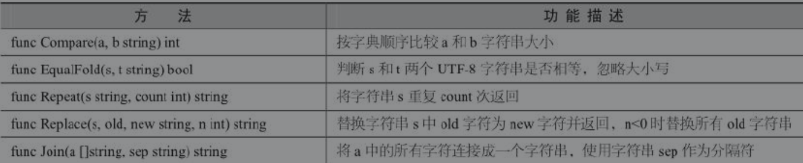
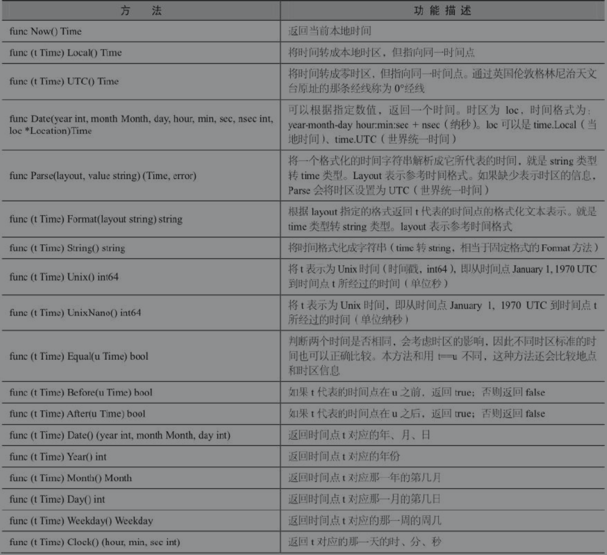
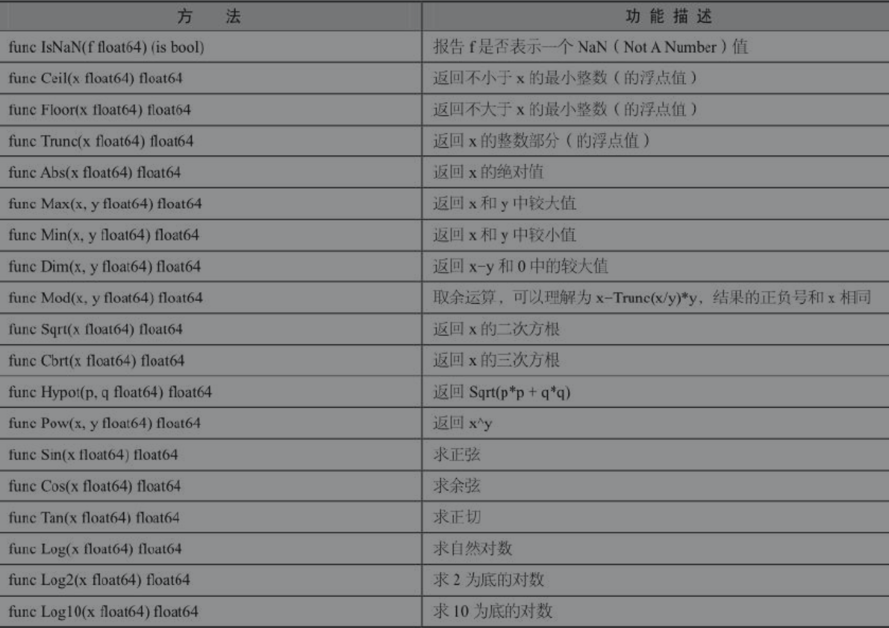
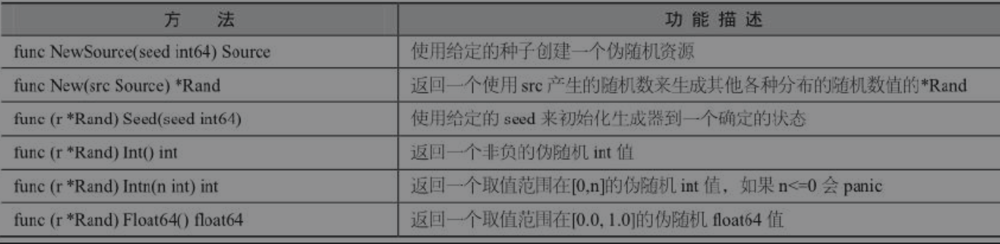
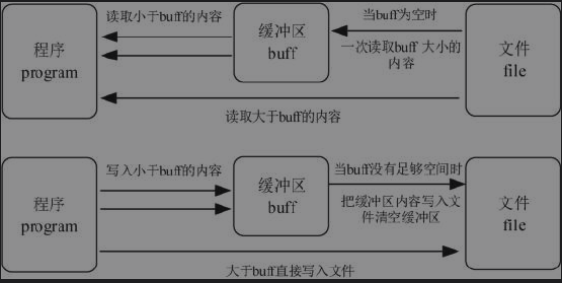

## 

### 0、new函数

new：用来分配内存，主要用来分配值类型：int、float32、struct...返回的是一个指向这个数据类型的指针。


### 1 字符串的操作

#### 1.1 字符串的遍历 ***

```c++
package main

import (
    "fmt"
    "unicode/utf8"
)

func main() {
    s1 := "火影whw"
    // 1、for ... range 遍历字符串
    for i, ch := range s1{
        fmt.Printf("%d:%c ",i, ch)
    }
    // 注意：一个中文字符占3个字节（unitcode编码规范）
    // 0:火 3:影 6:w 7:h 8:w

    // 2、遍历所有字节
    for i, ch := range []byte(s1){
        fmt.Printf("%d:%x ",i, ch)
    }
    // 0:e7 1:81 2:ab 3:e5 4:bd 5:b1 6:77 7:68 8:77

    // 3、遍历所有字符（包含中文）***
    for i, ch := range []rune(s1){
        fmt.Printf("%d:%c ",i, ch)
    }
    // 0:火 1:影 2:w 3:h 4:w

    // 4、带中文的字符串长度 ***
    fmt.Println("字符串长度>>> ",utf8.RuneCountInString(s1))
    //字符串长度>>>  5
}
```

可以看出，**如果字符串涉及中文，遍历字符推荐使用rune。因为一个byte存不下一个汉语文字的unicode值。**

#### 1.2 strings包的字符串处理函数

#### 检索字符串


#### 分割字符串


```c++
package main

import (
    "fmt"
    "strings"
    "unicode"
)

func main() {
    // 1、将字符串以空白字符分割，并返回一个切片
    ret := strings.Fields("   abc 123 ABC h s  XXYY")
    fmt.Println(ret) // [abc 123 ABC h s XXYY]

    // 2、将字符串以满足 f(r)==true 的字符分割，返回一个切片
    f := func(c rune) bool{
        // 既不是字母也不是数字 —— 特殊字符或者空格等。。。
        return !unicode.IsLetter(c) && !unicode.IsNumber(c)
    }
    ret = strings.FieldsFunc("abd#123*ghs@whw   sdf",f)
    fmt.Println(ret) // [abd 123 ghs whw sdf]

    // 3、将字符串以sep作为分隔符进行分割，分割后字符去掉sep
    ret1 := strings.Split("a,b,c",",")
    fmt.Println(ret1)//[a b c]
    // 全部分割
    ret2 := strings.Split("xyz sd 123","")
    fmt.Println(ret2)//[x y z   s d   1 2 3]
    // 没有的话列表中只有一个元素
    ret3 := strings.Split("aa,,,b,,c","*")
    fmt.Println(ret3)//[aa,,,b,,c]

    // 4、将字符串以sep作为分割符进行分割，分割后字符最后附上sep，n决定返回的切片中元素的数量
    ret1 = strings.SplitN("a,b,c,d",",",2) // 如果n大于最多的熟练则返回切片后所有的数
    fmt.Println(ret1)//[a b,c,d]
    ret1 = strings.SplitN("a,b,c,d",",",1) // 如果n大于最多的熟练则返回切片后所有的数
    fmt.Println(ret1)//[a,b,c,d]

    // 5、将字符串以sep作为分隔符进行分割，分割后字符最后附上sep
    ret = strings.SplitAfter("a,b,c,d",",")
    fmt.Println(ret) // [a, b, c, d]  ———— 注意d后面本身没有逗号，所以转成切片后也没有逗号

    // 6、将字符串以sep作为分隔符进行分割，分割后字符最后附上sep，n决定返回的切片中元素的数量
    ret = strings.SplitAfterN("a,b,c,d",",",2)
    fmt.Println(ret)//[a, b,c,d]
}
```

#### 大小写转换


```c++
package main

import (
    "fmt"
    "strings"
)

func main() {
    // 1、将字符串每个单词首字母大写返回
    ret := strings.Title("my name is narutoOO! ")
    fmt.Println(ret)//My Name Is NarutoOO!

    // 2、将字符串转换成大写返回
    ret = strings.ToTitle("lius fdaSD*&")
    fmt.Println(ret)//LIUS FDASD*&

    // 3、将字符串转换成小写返回
    ret = strings.ToLower("ASD sdf#sASED faASDS")
    fmt.Println(ret)//asd sdf#sased faasds

    // 4、将字符串转换成大写返回
    ret = strings.ToUpper("lius fdaSD*&")
    fmt.Println(ret)//LIUS FDASD*&
}
```

#### 修剪字符串


```c++
package main

import (
    "fmt"
    "strings"
    "unicode"
)

func main() {
    // 1、将字符串首尾包含在cutset中的任意一个字符去掉返回
    ret := strings.Trim("   see  wang   "," ")
    fmt.Println(ret)//see  wang

    // 2、将字符串首尾满足函数 f(r)==true 的字符去掉返回
    f := func(c rune) bool{
        // 既不是字符也不是数字
        return !unicode.IsLetter(c) && !unicode.IsNumber(c)
    }
    ret = strings.TrimFunc("**dd%$sadf  123!2&()",f)
    fmt.Println(ret)//dd%$sadf  123!2

    // 3、将字符串左边包含在cutset中的任意一个字符去掉返回
    ret = strings.TrimLeft("**&!1231**","*")
    fmt.Println(ret)//&!1231**

    // 4、将字符串左边满足函数 f(r)==true 的字符去掉返回
    ret = strings.TrimLeftFunc("**dd%$sadf  123!2&()",f)
    fmt.Println(ret)//dd%$sadf  123!2&()

    // 5、将字符串右边包含在cutset中的任意一个字符去掉返回
    ret = strings.TrimRight("**&!1231**","*")
    fmt.Println(ret)//**&!1231

    // 6、将字符串右边满足函数 f(r)==true 的字符去掉返回
    ret = strings.TrimRightFunc("**dd%$sadf  123!2&()",f)
    fmt.Println(ret)//**dd%$sadf  123!2
}
```

#### 比较字符串



```c++
package main

import (
    "fmt"
    "strings"
)

func main() {
    // 1、按照字典顺序比较2个字符串的大小
    fmt.Println(strings.Compare("abc","acd")) // -1
    fmt.Println("abc" < "acd") // true

    // 2、判断两个 UTF-8字符串是否相等，忽略大小写
    fmt.Println(strings.EqualFold("Go","go"))// true

    // 3、将字符串重复count次返回
    ret := "g" + strings.Repeat("had",3) + "le"
    fmt.Println(ret)//ghadhadhadle

    // 4、替换字符串s中old字符为new字符并返回， n<0 时替换所有old字符
    ret1 := strings.Replace("王老大 王老二 王老三","王","张",2)
    fmt.Println(ret1)//张老大 张老二 王老三
    ret2 := strings.Replace("王老大 王老二 王老三","王","张",-1)
    fmt.Println(ret2)//张老大 张老二 张老三

    // 5、将a中所有字符连接成一个字符串，使用字符串sep作为分割符 ————— Join
    s := []string{"abc","ABC","123"}
    ret1 = strings.Join(s,",")
    fmt.Println(ret1)//abc,ABC,123
    ret2 = strings.Join(s,"")
    fmt.Println(ret2)//abcABC123
}
```

### 1.3 字符串其他操作

#### 0）修改字符串

如果想修改字符串，可以先将 string -> []byte / 或者 []rune->修改->重写转成string。


#### 1) 统计字符串长度(按字节)

**len函数**

```c++
str := "火影whw"
fmt.Println(len(str)) // 9   注意一个中文字符占3个unitcode位
```

#### 2) 字符串遍历，同时处理有中文的问题

**r := []rune(str)**

```c++
str := "火影whw"
newStr := []rune(str)
for i,val := range newStr{
  fmt.Printf("%d:%c ",i,val)
}
// 0:火 1:影 2:w 3:h 4:w
```

#### 3) 字符串转整数

```c++
n, err := strconv.Atoi("123")
if err != nil{
  fmt.Println("转换错误",err)
}else{
  fmt.Printf("result>>> %v, %T \n",n, n) //123, int 
}
```

#### 4) 整数转字符串

```c++
str := strconv.Itoa(123)
fmt.Printf("str>>> %v, %T \n",str, str) // 123, string 
```

#### 5) 


#### 6) 查找子串是否在指定的字符串中

```c++
b := strings.Contains("wanghw","ang")
    fmt.Println(b)// true
```

#### 7) 统计一个字符串有几个指定的子串

```c++
strings.Count("Chinese","c")
```

#### 8) 不区分大小写的比较

```c++
result := strings.EqualFold("whw","Whw")
fmt.Println(result)// true
```

#### 9) 其他整合

```c++
// 返回子串第一次出现的index值，没有就返回-1
    index := strings.Index("wanghw","w")
    fmt.Println(index)// 0

    // 返回子串在字符串最后一次出现的index，没有返回-1
    index = strings.LastIndex("wanghw","w")
    fmt.Println(index)// 5

    // 将指定的子串替换成另外一个子串，-1表示全部替换，可以设置想替换几个
    str := "go go hello"
    str1 := strings.Replace(str,"go","hi",1)
    fmt.Println(str1) // hi go hello

    // 按照某个字符串分割，返回一个字符数组
    strArr := strings.Split("hello;hi;whw",";")
    for _, val := range strArr{
        fmt.Printf("%s\t",val)//hello   hi      whw
    }

    // 大小写转换 全转成小写
    str = strings.ToLower("WansHW")
    fmt.Println(str)//wanshw

    // 大小写转换 全转成大写
    str = strings.ToUpper("shaSAl")
    fmt.Println(str)//SHASAL

    // 将字符串左右两边的空格都去掉
    str = "   asdf sdf jjj whw     "
    str1 = strings.TrimSpace(str)
    fmt.Println(str1) //asdf sdf jjj whw

    // 去掉左右两边指定的字符
    str = "!hello#!"
    str1 = strings.Trim(str,"!")
    fmt.Println(str1) //hello#

    // 去掉左边指定的字符：strings.TrimLeft(...)
    // 去掉右边指定的字符：strings.TrimRight(...)

    // 判断是否是以指定的字符串开头
    b := strings.HasPrefix("wanghyw","wa")
    fmt.Println(b) // true

    // 判断是否以指定字符串结束
    b = strings.HasSuffix("wanghhh,",",")
    fmt.Println(b) // true
```

### 2、strconv包常用函数

**strconv包实现了字符串与其他基本数据类型之间的类型转换。**

#### Parse类函数

Parse 类函数主要的功能是将字符串转换为其他类型，常用的 Parse 类函数如表：


```c++
package main

import (
    "fmt"
    "strconv"
)

func main() {
    // string -> int
    _int, _ := strconv.Atoi("97")
    fmt.Println(_int, _int == int(97))

    // string -> int64
    _int64, _ := strconv.ParseInt("97", 10, 64)
    fmt.Println(_int64, _int64 == int64(97))

  // https://stackoverflow.com/questions/30299649/parse-string-to-specific-type-of-int-int8-int16-int32-int64
    // string -> int32，注意 parseInt 始终返回的是 int64，所以还是需要 int32(n) 强转一下
    _int32, _ := strconv.ParseInt("97", 10, 32)
    fmt.Println(_int32, int32(_int32) == int32(97))
  
    // string -> float32/float64  https://yourbasic.org/golang/convert-string-to-float/
    f := "3.14159265"
    if s, err := strconv.ParseFloat(f, 32); err == nil {
        fmt.Println(s) // 3.1415927410125732
    }
    if s, err := strconv.ParseFloat(f, 64); err == nil {
        fmt.Println(s) // 3.14159265
    }
}
```


#### Format类函数

**Format类函数主要的功能是将其他类型格式化成字符串**


```c++
// 推荐一个更加强大的转换库：https://github.com/spf13/cast
package main

import (
    "fmt"
    "strconv"
)

func main() { // 测试 int 和 string(decimal) 互相转换的函数
    // https://yourbasic.org/golang/convert-int-to-string/
    // int -> string
    sint := strconv.Itoa(97)
    fmt.Println(sint, sint == "97")

    // byte -> string
    bytea := byte(1)
    bint := strconv.Itoa(int(bytea))
    fmt.Println(bint)

    // int64 -> string
    sint64 := strconv.FormatInt(int64(97), 10)
    fmt.Println(sint64, sint64 == "97")

    // int64 -> string (hex) ，十六进制
    sint64hex := strconv.FormatInt(int64(97), 16)
    fmt.Println(sint64hex, sint64hex == "61")

    // int32 -> string, https://stackoverflow.com/questions/39442167/convert-int32-to-string-in-golang
    fmt.Println("------- int32 -> string ------")
    res1 := strconv.FormatInt(int64(23), 10) // fast
    fmt.Println("res1>>> ",res1)
    res2 := strconv.Itoa(int(23)) // fast
    fmt.Println("res2>>> ",res2)
    res3 := fmt.Sprint(23) // slow
    fmt.Println("re3s>>> ",res3)
    fmt.Println("-------------")
    // int -> int64 ，不会丢失精度
    var n int = 97
    fmt.Println(int64(n) == int64(97))

    // float -> string https://yourbasic.org/golang/convert-string-to-float/
    s := fmt.Sprintf("%f", 123.456)
    fmt.Println("s>>> ",s)
}
```

### 3、时间处理函数

#### 3.0 time包常用函数




### 4、 math包常用函数



### 5、随机数

“math/rand”包实现了伪随机数生成器，能够生成**整型**和**浮点型**的随机数。

使用随机数生成器需要放入种子。可以使用Seed()函数生成一个不确定的种子放入随机数生成器，这样每次运行随机数生成器都会生成不同的序列。如果没有在随机数生成器中放入种子，则默认使用具有确定性状态的种子，此时可以理解为种子的值是一个常数1，即Seed(1)。



#### 获取随机数的几种方式

```c++
println(rand.Int())
println(rand.Float64())
println(rand.Intn(12))// 获取 0-12随机数
```

**这样总是生成固定的随机数。默认情况下，随机数种子都是1。seed是一个64位整数。**

动态随机数种子生成随机资源，产生随机对象来获取随机数，具体方法如下所示:

```c++
s1 := rand.NewSource(time.Now().UnixNano())
r1 := rand.New(s1)
randNum := r1.Intn(12) // 0-12随机数
fmt.Println(randNum)
```

**简写形式：动态变化随机数种子来获取随机数，具体方法如下所示:**

（1）获取整型 0～10随机数

```c++
rand.Seed(time.Now().UnixNano())
rand.Intn(10)
```

（2）获取浮点型 0.0～1.0随机数

```c++
rand.Seed(time.Now().UnixNano())
rand.Float64()
```

（3）获取 m～n随机数

```c++
rand.Seed(time.Now().UnixNano())
随机数 = rand.Intn(n - m + 1) + m
```

比如 获取 [5,11]随机数，语法如下：

```c++
rand.Intn(7) + 5
```

### 6、regexp正则表达式包

#### regexp包中核心函数及方法介绍

```c++
package main

import (
    "fmt"
    "regexp"
)

func main() {

    // 1、检查正则表达式与字节数组是否匹配
    flag, _ := regexp.Match("^\\d{6,15}$",[]byte("1234556788"))
    fmt.Println(flag)//true

    // 2、检查正则表达式与字符串是否匹配。
    flag, _ = regexp.MatchString("^\\d{1,12}$","123222333")
    fmt.Println(flag)//true

    // 3、将正则表达式字符串编译成正则表达式对象（Regexp）
    MyRegexp, _ := regexp.Compile("^\\d{2,22}$")
    flag = MyRegexp.MatchString("123123a")
    fmt.Println(flag)//false

    // 4、ReplaceAll()将src中符合正则表达式的部分全部替换成指定内容。
    text := "啊哈哈 123 嘿嘿嘿 333 火影 123222"
    MyRegexp2, _ := regexp.Compile("[\\d\\s]+")
    ret := MyRegexp2.ReplaceAll([]byte(text),[]byte("x"))
    fmt.Println(string(ret))//啊哈哈x嘿嘿嘿x火影x

    // 5、将字符串按照正则表达式分割成子字符串组成的切片。如果切片长度超过指定参数n，则不再分割。
    text = "第一#第二##第三###第四####第五#####第六######第七####第八##第九"
    MyREgexp3, _ := regexp.Compile("#+")
    arr := MyREgexp3.Split(text,5)
    fmt.Println(arr)//[第一 第二 第三 第四 第五#####第六######第七####第八##第九]
}
```

### 7 Go语言文件I/O操作

### 7.1 文件概述

所谓“文件”，是指一组相关数据的有序集合。文件通常是驻留在外部介质（如磁盘等）上的，在使用时才调入内存。计算机系统是以文件为单位来对数据进行管理的。

一个文件要有由文件路径、文件名主干和文件名后缀（Windows有时会隐藏）组成的唯一标识，以便用户识别和引用，它常被称为文件名，但注意，此时所称的文件名包括3部分内容，而不是文件名主干。文件名主干遵守标识符的命名规则。文件名后缀用来表示文件的形式，一般不超过3个字母。如exe（可执行文件）、go（Go语言程序文件）、txt（文本文件）等。

### 7.2 FIleInfo接口

文件的信息包括文件名、文件大小、修改权限、修改时间等。

Go语言系统文件信息接口属性定义如下所示。


fileStat结构体（文件信息）定义如下所示。


fileStat结构体的常用方法如下所示。


**想要查看文件的信息，必须要知道文件的路径。**

下面通过一个案例演示获取文件信息：

```c++
package main

import (
    "fmt"
    "os"
)

func main() {
    // 绝对路径
    path := "/Users/Wanghongwei/Desktop/ppyt.py"
    printMessage(path)
    /*
        数据类型是:*os.fileStat
        文件名: ppyt.py
        是否为目录: false
        文件大小: 21
        文件权限: -rw-r--r--
        文件最后修改时间: 2020-11-10 14:32:31.806397859 +0800 CST
    */
}

func printMessage(filePath string) {
    fileInfo, err := os.Stat(filePath)
    if err != nil {
        fmt.Println("err:", err.Error())
    } else {
        fmt.Printf("数据类型是:%T \n", fileInfo)
        fmt.Println("文件名:", fileInfo.Name())
        fmt.Println("是否为目录:", fileInfo.IsDir())
        fmt.Println("文件大小:", fileInfo.Size())
        fmt.Println("文件权限:", fileInfo.Mode())
        fmt.Println("文件最后修改时间:", fileInfo.ModTime())
    }
}
```

#### 文件权限简单说明

文件的权限打印出来一共10个字符。文件有3种基本权限：r（read，读权限）、w（write，写权限）、x（execute，执行权限）。文件权限说明如图所示。


**文件权限简单说明：**


**文件权限八进制表示法**


例如：-rwxrwxrwx权限用八进制表示为：0777

### 7.3 文件路径

与文件路径相关的方法如表：


```c++
package main

import (
    "fmt"
    "path"
    "path/filepath"
)

func main() {
    // 绝对路径
    filePath1 := "/Users/Wanghongwei/DeskTop/ppyt.py"
    // 相对路径
    filePath2 := "../t2/variable.go"
    // 是否为绝对路径
    fmt.Println(filepath.IsAbs(filePath1)) // true
    fmt.Println(filepath.IsAbs(filePath2)) // false
    // 获取相对路径
    fmt.Println(filepath.Rel("/Users/Wanghongwei",filePath1)) //DeskTop/ppyt.py <nil>
    // 获取绝对路径
    fmt.Println(filepath.Abs(filePath1)) ///Users/Wanghongwei/DeskTop/ppyt.py <nil>
    fmt.Println(filepath.Abs(filePath2)) ///Users/wanghongwei/GoProject/t2/variable.go <nil>
    // 拼接路径
    fmt.Println(path.Join(filePath1,"..")) ///Users/Wanghongwei/DeskTop
    fmt.Println(path.Join(filePath1,"../..")) ///Users/Wanghongwei
    fmt.Println("/Users/Wanghongwei/Desktop",filePath2) ///Users/Wanghongwei/Desktop ../t2/variable.go
}
```

### 7.4 文件常规操作

#### 创建目录

**创建目录时，如果目录存在，则创建失败。Go语言提供了两种方法。**

**1. os.Mkdir()**

os.MKdir()仅创建一层目录。官方文档解释如下所示。

```c++
// Mkdir creates a new directory with the specified name and permission
// bits (before umask).
// If there is an error, it will be of type *PathError.
```

**2. os.MKdirAll()**

os.MKdirAll()创建多层目录。

```c++
package main

import (
    "fmt"
    "os"
)

func main() {
    // 创建单个目录
    filePath1 := "./test1"
    err := os.Mkdir(filePath1,os.ModePerm)
    if err != nil{
        fmt.Println("err>> ",err)
    }

    // 创建多级目录
    filePath2 := "./test2/adb/xyz"
    err = os.MkdirAll(filePath2,os.ModePerm)
    if err != nil{
        fmt.Println("err>> ",err)
    }
}
```

#### 创建文件

os.Create()创建文件，如果文件存在，会将其覆盖。官方文档解释如下所示。

```c++
// Create creates or truncates the named file. If the file already exists,
// it is truncated. If the file does not exist, it is created with mode 0666
// (before umask). If successful, methods on the returned File can
// be used for I/O; the associated file descriptor has mode O_RDWR.
// If there is an error, it will be of type *PathError.
func Create(name string) (*File, error) {
    return OpenFile(name, O_RDWR|O_CREATE|O_TRUNC, 0666)
}
```

**该函数本质上是在调用os.OpenFile()函数。**

```c++
package main

import (
    "fmt"
    "os"
)

func main() {
    filePath := "./test1/abc.json"
    file, err := os.Create(filePath)
    if err != nil{
        fmt.Println("err>>> ",err)
    }else{
        fmt.Println("file>>> ", file)
    }
}
```

#### 打开和关闭文件

打开文件：让当前的程序和指定的文件建立一个链接。

os.Open()函数本质上是在调用os.OpenFile()函数。

```c++
// Open opens the named file for reading. If successful, methods on
// the returned file can be used for reading; the associated file
// descriptor has mode O_RDONLY.
// If there is an error, it will be of type *PathError.
func Open(name string) (*File, error) {
    return OpenFile(name, O_RDONLY, 0)
}
```

```c++
// OpenFile is the generalized open call; most users will use Open
// or Create instead. It opens the named file with specified flag
// (O_RDONLY etc.). If the file does not exist, and the O_CREATE flag
// is passed, it is created with mode perm (before umask). If successful,
// methods on the returned File can be used for I/O.
// If there is an error, it will be of type *PathError.
func OpenFile(name string, flag int, perm FileMode) (*File, error) {
    testlog.Open(name)
    f, err := openFileNolog(name, flag, perm)
    if err != nil {
        return nil, err
    }
    f.appendMode = flag&O_APPEND != 0

    return f, nil
}
```

**示例：**

```c++
package main

import (
    "fmt"
    "os"
)

func main() {
    filePath := "./test1/abc.json"
    // 打开文件
    file, err := os.Open(filePath)
    if err != nil{
        fmt.Println("err>>> ",err)
    }else{
        fmt.Println("file>>> ",file)
    }

    // 以读写的方式打开，如果文件不存在就创建 
  // ———— 注意 目录必须存在！！！
    filePath2 := "./test2/aaa.json"
    file2, err2 := os.OpenFile(filePath2,os.O_CREATE,os.ModePerm)
    if err2 != nil{
        fmt.Println("err>>> ",err2)
    }else{
        fmt.Println("file2>>> ",file2)
    }
}
// 关闭文件
file.close()
file2.close()
```

#### 删除文件

删除文件有两种方法，如下所示：


```c++
package main

import (
    "fmt"
    "os"
)

func main() {
    // 1 删除单个文件或目录
    filePath := "./test1/abc.json"
    err := os.Remove(filePath)
    if err != nil{
        fmt.Println(err)
    }

    // 2 将目录中所有文件及目录删除 包括这个根目录！
    filePath2 := "./test2"
    err2 := os.RemoveAll(filePath2)
    if err2 != nil{
        fmt.Println(err2)
    }

    // 3 使用 os.Remove 方法删除非空的目录会报错！！！
    filePath3 := "./test3" // test3中有东西
    err3 := os.Remove(filePath3)
    if err3 != nil{
        fmt.Println("err3>>> ",err3) // remove ./test3: directory not empty
    }else{
        fmt.Println(filePath3)
    }
}
```

#### 读取文件

**读取文件数据**

```c++
package main

import (
    "fmt"
    "io"
    "os"
)

func main() {
    // 读取文件数据
    filePath := "./test1/abc.txt"
    file, err := os.Open(filePath)
    if err != nil{
        fmt.Println("err>>> ",err)
    }else{
    // 读取文件
        bs := make([]byte,1024*8,1024*8)
        n := -1
        for {
            n, err = file.Read(bs)
            if n == 0 || err == io.EOF{
                fmt.Println("读取文件结束！")
                break
            }
            fmt.Println(string(bs[:n]))
        }
    }
    // 关闭文件
    file.Close()
}
/*
whw
123
666
王宏伟666
读取文件结束！
 */
```

#### 写入文件

```c++
package main

import (
    "fmt"
    "os"
)

func main() {
    // 读取文件数据
    filePath := "./test1/writeTest.txt"
    file, err := os.OpenFile(filePath,os.O_RDWR|os.O_CREATE,os.ModePerm)
    if err != nil{
        fmt.Println("err>>> ",err)
    }else{
        // 写入文件
        n, err := file.Write([]byte("abdcsa13\n"))
        if err != nil{
            fmt.Println("写入文件异常:",err)
        }else{
            fmt.Println("n:",n) // 9
        }
        // 写入汉字！
        n, err = file.WriteString("王宏伟666")
        if err != nil{
            fmt.Println("写入汉字异常>>",err)
        }else{
            fmt.Println("n:",n) // 12
        }
    }
    // 关闭文件
    file.Close()
}
```

#### 复制文件

Go语言提供了copyFile()方法，用来复制文件。

```c++
package main

import (
    "fmt"
    "io"
    "os"
)

func main() {
    // 源文件相对路径
    srcFilePath := "./test1/writeTest.txt"
    // 准备生成的目标文件路径 ！ 注意test2这个目录必须存在！！！
    newFilePath := "./test2/copyTest.txt"
    total, err := copyFile(newFilePath,srcFilePath)
    if err != nil{
        fmt.Println("err:",err)
    } else{
        fmt.Println("复制OK！",total)
    }
}

func copyFile(destFile, srcFile string)(int64, error){
    file1, err := os.Open(srcFile)
    if err != nil{
        return 0, err
    }
    file2, err := os.OpenFile(destFile,os.O_RDWR|os.O_CREATE,os.ModePerm)
    if err != nil{
        return 0, err
    }
    // defer close
    defer file1.Close()
    defer file2.Close()
    // 复制！
    return io.Copy(file2, file1)
}
```

### 7.5 ioutil包

ioutil包的核心函数如表所示：


```c++
package main

import (
    "fmt"
    "io/ioutil"
    "os"
)

func main() {
    // 打开文件
    filePath1 := "./test1/writeTest.txt"
    data, err := ioutil.ReadFile(filePath1)
    if err != nil{
        fmt.Println("err>> ",err)
    }else{
        fmt.Println("data>> \n",string(data))
    }

    // 写入文件 会覆盖之前的内容！
    filePath2 := "./test2/copyTest.txt"
    writeString := "金刚葫芦娃"
    err = ioutil.WriteFile(filePath2,[]byte(writeString),os.ModePerm)
    if err != nil{
        fmt.Println("写入文件失败")
    }

    // 文件复制
    err = ioutil.WriteFile(filePath2,data,os.ModePerm)
    if err != nil{
        fmt.Println("文件复制异常！",err.Error())
    }

    // 遍历目录 v是指定目录里的文件或文件夹
    dirName := "./"
    fileInfos, err := ioutil.ReadDir(dirName)
    if err != nil{
        fmt.Println("目录遍历异常！",err.Error())
    }else{
        for i, v := range fileInfos{
            fmt.Println(i, v.Name(), v.IsDir(),v.Size(), v.ModTime())
        }
    }

    // 创建目录
    fileName, err := ioutil.TempDir("./","temp")
    if err != nil{
        fmt.Println("创建目录失败！",err.Error())
    }else{
        // 注意后面还有数字！temp736138268
        fmt.Println("fileName>>> ",fileName)
    }

    // 创建文件
    file1, err1 := ioutil.TempFile(fileName,"test.txt")
    if err1 != nil{
        fmt.Println("err1>>> ",err1)
    }else{
        // 注意文件名后面也有随机数字！
        file1.WriteString("写入内容：" + file1.Name())
    }
    file1.Close()
}
```

### 7.6 bufio包

**bufio实现了带缓冲的I/O操作，达到高效读写。**

**缓冲区的原理**

bufio包对io包下的对象Reader、Writer进行包装，分别实现了io.Reader和io.Writer接口，提供了数据缓冲功能，能够一定程度减少大块数据读写带来的开销，所以bufio比直接读写更快。

把文件读取进缓冲区之后，再读取的时候就可以避免文件系统的输出，从而提高速度；在进行写操作时，先把文件写入缓冲区，然后由缓冲区写入文件系统。

有人可能会困惑：直接把“内容—文件”和“内容—缓冲区—文件”相比，缓冲区似乎没有起到作用。其实在生活中也有这样的例子，比如每当家里产生垃圾的时候，不会有人马上去楼下倒垃圾，因为这样反复地上下楼非常麻烦，通常家里都会准备个小垃圾桶，等垃圾桶装满了之后把一批垃圾一起倒掉。用计算机的思想来看，垃圾桶就充当了缓冲区的角色。

缓冲区的设计是为了存储多次的写入，最后一口气把缓冲区内容写入文件。当发起一次读写操作时，计算机会首先尝试从缓冲区获取数据；只有当缓冲区没有数据时，才会从数据源获取数据更新缓冲。



**Scanner**

实际使用中，更推荐使用Scanner对数据进行读取，而非直接使用Reader类。Scanner可以通过splitFunc将输入数据拆分为多个token，然后依次进行读取。和Reader类似，Scanner需要绑定到某个io.Reader上，通过NewScanner()进行创建。

默认方法如表：


bufio 模块提供了几个默认splitFunc，能够满足大部分场景的需求，如下表所示：


可以为Scanner指定splitFunc，方法如下所示：

```c++
scanner.split(bufio.ScanWords)
```

```c++
package main

import (
    "bufio"
    "fmt"
    "strings"
)

func main() {
    // 创建Reader对象并传入要分割的字符串
    reader1 := bufio.NewReader(strings.NewReader("abcsdsaf 123 dfs"))
    // 创建Scanner对象
    scanner := bufio.NewScanner(reader1)
    // 指定分割方法，按照空格进行拆分
    scanner.Split(bufio.ScanWords)
    // 循环读取
    for scanner.Scan(){
        fmt.Println(scanner.Text())
        if scanner.Text() == "q!"{
            break
        }
    }
}
/*
abcsdsaf
123
dfs
 */
```

**bufio.Reader结构体**

1. bufio.Reader

bufio.Reader的常用方法如表:


2. NewReader()与NewReaderSize()

将rd封装成一个拥有size大小缓存的bufio.Reader对象，NewReader()相当于NewReaderSize(rd, 4096)。

3. Read()

bufio.Read(p []byte) 相当于读取大小为len(p)的内容，使用思路如下。（1）当缓冲区有内容时，将缓冲区内容全部填入p并清空缓冲区。（2）当缓冲区没有内容且len(p)＞len(buf)，即要读取的内容比缓冲区还要大，直接去文件读取即可。（3）当缓冲区没有内容且len(p)＜len(buf)，即要读取的内容比缓冲区小，缓冲区从文件读取内容充满缓冲区，并将p填满（此时缓冲区有剩余内容）。（4）以后再次读取时缓冲区有内容，将缓冲区内容全部填入p并清空缓冲区，同情况（1）。

4. ReadLine()

ReadLine()是一个低级的、原始的行读取操作，大多数情况下，应该使用ReadBytes('\n')或ReadString('\n')，或者使用一个Scanner。ReadLine()通过调用ReadSlice()方法实现，返回的也是缓存的切片。ReadLine()尝试返回一个单行数据，不包括行尾标记（\n或\r\n），如果在缓存中找不到行尾标记，则设置isPrefix为true，表示查找未完成，同时读出缓存中的数据并作为切片返回；只有在当前缓存中找到行尾标记，才将isPrefix设置为false，表示查找完成。可以多次调用ReadLine()来读出一行，返回的数据在下一次读取操作之前是有效的。如果ReadLine()无法获取任何数据，则返回一个错误信息（通常是io.EOF）。

5. ReadBytes() ***

ReadBytes()在b中查找delim并读出delim及其之前的所有数据。如果ReadBytes()在找到delim之前遇到错误，则返回遇到错误之前的所有数据，同时返回遇到的错误（通常是io.EOF）。只有当ReadBytes()找不到delim时，err才不为nil。

对于简单的任务，使用Scanner可能更方便。

6. ReadString() ***

ReadString()功能同ReadBytes()，只不过返回的是一个字符串。

```c++
package main

import (
    "bufio"
    "fmt"
    "io"
    "os"
)

func main() {
    testReader()
}

func testReader(){
    fileName1 := "./test1/abc.txt"
    // 打开文件
    file1, _ := os.Open(fileName1)
    // 创建缓冲区
    reader1 := bufio.NewReader(file1)
    fmt.Printf("%T \n", reader1) // *bufio.Reader
    // 从缓冲区冲读取
    for {
        // 以/n问分隔符读取
        s1, err := reader1.ReadString('\n')
        fmt.Println(s1)
        if err == io.EOF{
            fmt.Println("读取完毕")
            break
        }
    }
    file1.Close()
}
```

**bufio.Writer结构体**

1. buffo.Writer

bufio.Writer的常用方法如表:


2. Write()

bufio.Write(p []byte)的使用思路如下:

（1）判断缓冲区中可用容量是否可以放下 p。

（2）如果能放下，直接把p放到缓冲区。

（3）如果缓冲区的可用容量不足以放下p，且此时缓冲区是空的，直接把p写入文件即可。

（4）如果缓冲区的可用容量不足以放下p，且此时缓冲区有内容，则用p把缓冲区填满，把缓冲区所有内容写入文件，并清空缓冲区。

（5）判断p的剩余内容大小能否放到缓冲区，如果能放下则把内容放到缓冲区，同情况（2）。

（6）如果p的剩余内容依旧大于缓冲区（注意此时缓冲区是空的），则把p的剩余内容直接写入文件，同情况（3）。

```c++
package main

import (
    "bufio"
    "fmt"
    "io"
    "os"
)

func main() {
    testWriter()
}

func testWriter(){
    fileName := "./test1/abc.txt"
    // 打开文件
    file, _ := os.Open(fileName)
    // 创建读缓冲区
    reader := bufio.NewReader(file)
    fileName2 := "./test1/writeText.txt"
    // 打开文件
    file2, _ := os.OpenFile(fileName2,os.O_WRONLY|os.O_CREATE,os.ModePerm)
    // 创建读写缓冲区
    writer1 := bufio.NewWriter(file2)
    for{
        // 将读取到的数据写入另一个文件
        bs, err := reader.ReadBytes(' ')
        writer1.Write(bs)
        writer1.Flush()
        if err == io.EOF{
            fmt.Println("文件读取完毕")
            break
        }
    }
    file.Close()
    file2.Close()
}
```

## 