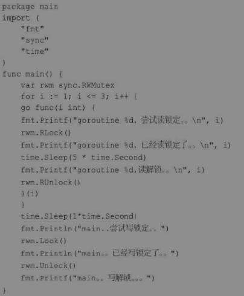

## 

### * Go语言网络编程相关

### HTTP协议客户端实现

Go语言标准库内置了net/http包，涵盖了HTTP客户端和服务端具体的实现方式。

内置的net/http包提供了最简洁的HTTP客户端实现方式，无须借助第三方网络通信库，就可以直接使用HTTP中用得最多的GET和POST方式请求数据。

**实现HTTP客户端就是客户端通过网络访问向服务端发送请求，服务端发送响应信息，并将相应信息输出到客户端的过程。实现客户端有多种方式 —— 这里只记http.NewRequest方法：**

```c++
package main

import (
    "fmt"
    "io/ioutil"
    "net/http"
)

func main() {
    testHttpNewRequest()
}

func testHttpNewRequest(){
    // 1. 创建一个客户端
    client := http.Client{}

    // 2. 创建一个请求，，请求的方式可以是get、post等
    request, err := http.NewRequest("GET","https://www.baidu.com",nil)
    // 检查错误
    CheckErr(err)

    // 3. 客户端发送请求
    cookName := &http.Cookie{Name: "username",Value: "wanghw"}
    // 添加cookie
    request.AddCookie(cookName)
    // response
    rep, err := client.Do(request)
    // 检查错误
    CheckErr(err)
    // 设置请求头
    request.Header.Set("Accept-Language","zh-cn")
    // defer 关闭body
    defer rep.Body.Close()
    // 查看请求头的数据
    fmt.Printf("Header:%+v \n",request.Header)
    fmt.Printf("响应状态码:%v \n",rep.StatusCode)

    // 4. 操作数据
    if rep.StatusCode == 200{
        data, err := ioutil.ReadAll(rep.Body)
        CheckErr(err)
        fmt.Println("网络请求成功！")
        fmt.Println(string(data))
    }else{
        fmt.Println("网络请求失败!状态码：",rep.Status)
    }
}

// 检查错误
func CheckErr(err error){
    defer func(){
        if ins, ok := recover().(error); ok{
            fmt.Println("程序出现异常...",ins.Error())
        }
    }()
    if err != nil{
        panic(err)
    }
}
```

### HTTP协议服务端实现

（略）

### * Go语言并发编程

### 1 并发与并行

并发（Concurrency）是同时处理许多个任务，实际上是把任务在不同的时间点交给处理器进行处理，在微观层面，任务不会同时运行。

并行（Parallelism）是把每一个任务分配给每一个处理器独立完成，多个任务一定是同时运行。并行就是同时做很多事情，乍听起来可能与并发类似，但实际上是不同的。


### 2 进程与线程

#### 并发相关的概念

程序是编译好的二进制文件，在磁盘上，不占用系统资源（CPU、内存、设备）。

进程是活跃的程序，占用系统资源，在内存中执行。程序运行起来，产生一个进程。

程序就像是剧本，进程就像是演戏，同一个剧本可以在多个舞台同时上演。同样，同一个程序也可以加载为不同的进程（彼此之间互不影响），比如同时运行两个QQ。

线程也叫轻量级进程，通常一个进程包含若干个线程。线程可以利用进程所拥有的资源。在引入线程的操作系统中，通常都是把进程作为分配资源的基本单位，而把线程作为独立运行和独立调度的基本单位，比如音乐进程，可以一边查看排行榜一边听音乐，互不影响。

#### 进程与线程的联系

进程和线程是操作系统级别的两个基本概念。计算机的核心是CPU，它承担了所有的计算任务，就像一座工厂，时刻在运行。进程就好比工厂的车间，它代表CPU所能处理的单个任务；进程是一个容器。线程就好比车间里的工人。一个进程可以包括多个线程，线程是容器中的工作单位。

### 3 Goroutine介绍

**协裎的概念**

协程（Coroutine），最初在1963年被提出，又称为微线程，是一种比线程更加轻量级的存在。正如一个进程可以拥有多个线程，一个线程也可以拥有多个协程。

协程是编译器级的，进程和线程是操作系统级的。协程不被操作系统内核管理，而完全由程序控制，因此没有线程切换的开销。和多线程比，线程数量越多，协程的性能优势就越明显。协程的最大优势在于其轻量级，可以轻松创建上万个而不会导致系统资源衰竭。

**Go语言中的协裎**

Go语言中的协程叫作Goroutine。Goroutine由Go程序运行时（runtime）调度和管理，Go程序会智能地将Goroutine中的任务合理地分配给每个CPU。创建Goroutine的成本很小，每个Goroutine的堆栈只有几kb，且堆栈可以根据应用程序的需要增长和收缩。

**Coroutine与Goroutine**

Goroutine能并行执行，Coroutine只能顺序执行；Goroutine可在多线程环境产生，Coroutine只能发生在单线程。Coroutine程序需要主动交出控制权，系统才能获得控制权并将控制权交给其他Coroutine。

Coroutine的运行机制属于协作式任务处理，应用程序在不使用CPU时，需要主动交出CPU使用权。如果开发者无意间让应用程序长时间占用CPU，操作系统也无能为力，计算机很容易失去响应或者死机。

Goroutine属于抢占式任务处理，和现有的多线程和多进程任务处理非常类似。应用程序对CPU的控制最终由操作系统来管理，如果操作系统发现一个应用程序长时间占用CPU，那么用户有权终止这个任务。

### 4 创建Goroutine

#### 普通函数创建Goroutine

在函数或方法前面加上关键字go，将会同时运行一个新的Goroutine。

**使用go关键字创建Goroutine时，被调用的函数往往没有返回值，如果有返回值也会被忽略。如果需要在Goroutine中返回数据，必须使用channel，通过channel把数据从Goroutine中作为返回值传出。**

Go程序的执行过程是：**Go程序启动时，runtime默认为main()函数创建一个Goroutine。创建和启动主Goroutine，初始化操作，执行main()函数，当main()函数结束，主Goroutine随之结束，程序结束。**

```c++
package main

import (
    "fmt"
    "time"
)

func hello(){
    fmt.Println("Say Hello!")
}

func main() {
    go hello()
    // time.Sleep(time.Second)
    fmt.Println("Main function...")
}
```

运行的结果会有2种：

一种是只有main function打印出来了。

另外一种是两个都打印出来了。

被启动的Goroutine叫作子Goroutine。如果main()的Goroutine终止了，程序将被终止，而其他Goroutine将不再运行。换句话说，所有Goroutine在main()函数结束时会一同结束。如果main()的 Goroutine比子Goroutine先终止，运行的结果就不会打印“Say Hello!”

在go hello()后面加一个time.sleep，在这种情况下，main()的Goroutine被用来睡觉1秒。现在go hello()有足够的时间在main Goroutine终止之前执行。

#### 匿名函数创建Goroutine

go关键字后也可以是匿名函数或闭包。

```c++
package main

import (
    "fmt"
    "time"
)

func main() {
    go func(){
        var times int
        for {
            times ++
            fmt.Println("tick>>> ",times)
            time.Sleep(time.Second)
        }
    }()
    // 当用户有输入后 程序停止！
    var input string
    fmt.Scanln(&input)
}
```

### 5 启动多个Goroutine

```c++
package main

import (
    "fmt"
    "time"
)

func main() {
    go printNum()
    go printLetter()
    time.Sleep(6 *time.Second)
    fmt.Println()
    fmt.Println("main...function...")

}

func printNum() {
    for i := 1; i < 3; i++ {
        time.Sleep(time.Second)
        fmt.Printf("%d", i)
    }
}

func printLetter() {
    for i := 'a'; i < 'c'; i++ {
        time.Sleep(time.Second)
        fmt.Printf("%c", i)
    }
}
// 结果
// a12b // 四个字母的顺序每次不一样
// main...function...
```

### 6 channel ***

channel即Go的通道，是协程之间的通信机制。一个channel是一条通信管道，**它可以让一个协程通过它给另一个协程发送数据**。

每个channel都需要指定数据类型，即channel可发送数据的类型。如果使用channel发送int类型数据，可以写成chanint。数据发送的方式如同水在管道中的流动。

传统的线程之间可以通过共享内存进行数据交互，不同的线程共享内存的同步问题需要使用锁来解决，这样会导致性能低下。

Go语言中提倡使用channel的方式代替共享内存。换言之，Go语言主张**通过数据传递来实现共享内存，而不是通过共享内存来实现数据传递。**

#### 创建channel类型

```c++
var  ca(channel变量) chan  int(channel类型)
```

chan类型的空值是nil，声明后需要配合make()才能使用！

channel是引用类型，需要使用make()进行创建，语法格式如下所示。

```c++
ca := make(chan int)
```

**实例如下：**

c++
// 创建一个整型类型的channel
ch1 := make(chan int) 

// 创建一个空接口类型的channel，可以存放任意类型
ch2 := make(chan interface{})

// 创建一个结构体指针类型的channel，可以存放对应的结构体指针
type Student struct{
  name string
}
ch3 := make(chan *Student)
```

#### 使用channel发送数据

通过channel发送数据需要使用特殊的操作符“＜-”。将数据通过channel发送的语法格式如下所示。

```c++ 
channel变量  <-  值
```

channel发送的值的类型必须与channel的元素类型一致。如果接收方一直没有接收，那么发送操作将持续阻塞。此时所有的Goroutine，包括main()的Goroutine都处于等待状态。

运行会提示报错：fatal error: all goroutines are asleep - deadlock!

**使用channel时要考虑发生死锁（deadlock）的可能。如果Goroutine在一个channel上发送数据，其他的Goroutine应该接收得到数据；如果没有接收，那么程序将在运行时出现死锁。如果Goroutine正在等待从channel接收数据，其他一些Goroutine将会在该channel上写入数据；如果没有写入，程序将会死锁。**

#### 通过channel接受数据

channel收发操作在不同的两个Goroutine间进行。

##### 1. 阻塞接受数据

channel接收同样使用特殊的操作符“＜-”。语法格式如下所示。

```c++ 
data, ok := <-ch1
```

执行该语句时channel将会阻塞，直到接收到数据并赋值给data变量。

data 表示接收到的数据。未接收到数据时，data为channel类型的零值。ok（布尔类型）表示是否接收到数据。通过ok值可以判断当前channel是否被关闭。

##### 2. 忽略接受数据

接收任意数据，忽略接收的数据，语法格式如下所示。

```c++
<-ch1
```

执行该语句时channel将会阻塞。**其目的不在于接收channel中数据，而是为了阻塞Goroutine。**

##### 3. 循环接受数据

循环接收数据，需要配合使用关闭channel，借助普通for循环和for ... range语句循环接收多个元素。

遍历channel，遍历的结果就是接收到的数据，数据类型就是channel的数据类型。普通for循环接收channel数据，需要有break循环的条件；for … range会自动判断出channel已关闭，而无须通过判断来终止循环。循环接收数据的三种语法格式如下：

```c++
package main

import (
    "fmt"
)

func main() {
    ch1 := make(chan string)
    go sendData(ch1)
    // 循环接受数据的方式1
    /*
    for{
        data := <-ch1
        // 如果通道关闭，通道中传输的数据则为各数据类型的零值
        if data == ""{
            break
        }
        fmt.Println("从channel中获取数据的方式1>>>:",data)
    }
     */

    // 循环接受数据方式2
    /*
    for{
        data, ok := <-ch1
        fmt.Println("ok>>> ",ok)
        // 如果通道关闭了 ok为 false
        if !ok{
            break
        }
        fmt.Println("从channel中获取数据的方式2>>>:",data)
    }
     */

    // 循环接受数据方式3
    // for ... range 循环会自动判断通道是否关闭，自动break
    for value := range ch1{
        fmt.Println("从channel中获取数据的方式3>>>:",value)
    }
}

// 往channel中发送数据
func sendData(ch1 chan string) {
    // 发送完记得关闭
    defer close(ch1)
    for i := 0; i < 3; i++ {
        ch1 <- fmt.Sprintf("发送数据%d\n", i)
    }
    fmt.Println("发送数据完毕...")
}
```

#### channel是阻塞的

channel默认是阻塞的。当数据被发送到channel时会发生阻塞，直到有其他Goroutine从该channel中读取数据。当从channel读取数据时，读取也会被阻塞，直到其他Goroutine将数据写入该channel。这些channel的特性帮助Goroutine有效地通信，而不需要使用其他语言中的显式锁或条件变量。

```c++
package main

import "fmt"

func main() {
    var ch1 chan int
    ch1 = make(chan int)
    fmt.Printf("%T\n",ch1)// chan int
    ch2 := make(chan bool)

    go func(){
        data, ok := <-ch1
        if ok{
            fmt.Println("子Goroutine取到数值: ",data)
        }
        ch2 <- true
    }()

    ch1 <- 10
    <- ch2 // 阻塞：作用是阻塞channel等待匿名函数的Goroutine运行结束，防止主函数的Goroutine退出而导致匿名函数的Goroutine提前退出。
    fmt.Println("main over...")
}
/*
chan int
子Goroutine取到数值:  10
main over...
 */
```

注意   **<- ch2   作用是阻塞channel等待匿名函数的Goroutine运行结束，防止主函数的Goroutine退出而导致匿名函数的Goroutine提前退出。**

#### 关闭channel

发送方如果数据写入完毕，需要关闭channel，用于通知接收方数据传递完毕。

通常情况是发送方主动关闭channel。接收方通过多重返回值判断channel是否关闭，如果返回值是false，则表示channel已经被关闭。

往关闭的channel中写入数据会报错：panic: send on closed channel。

但是可以从关闭后的channel中读取数据，返回数据的默认值和false。

下面通过一个案例来观察关闭channel以后是否可以写入数据：

```c++
package main

import "fmt"

func main() {
    // channel1 关闭后不可以再写入数据
    ch1 := make(chan int)
    go func(){
        ch1 <- 100
        ch1 <- 200
        close(ch1)
        ch1 <- 222

    }()
    data, ok := <- ch1
    fmt.Println("main读取数据:",data, ok)
    data, ok = <- ch1
    fmt.Println("main读取数据:",data, ok)
    // 运行到这里的时候程序会报错！！！
    data, ok = <- ch1
    fmt.Println("main读取数据:",data, ok)
}
```

#### 缓冲channel

默认创建的都是非缓冲channel，读写都是即时阻塞。

缓冲channel自带一块缓冲区，可以暂时存储数据，如果缓冲区满了，就会发生阻塞。

下面通过案例对比缓冲channel与非缓冲channel：

```c++
package main

import (
    "fmt"
    "time"
)

func main() {
    // 1. 非缓冲channel
    ch1 := make(chan int)
    fmt.Println("非缓冲channel>> ",len(ch1), cap(ch1))
    go func(){
        data := <- ch1
        fmt.Println("获得数据:",data)
    }()
    //
    ch1 <- 100
    time.Sleep(time.Second)
    fmt.Println("赋值OK","main over...")

    // 2. 非缓冲channel
    ch2 := make(chan string)
    go sendData(ch2)
    for data := range ch2{
        fmt.Println("\t 从ch2中读取数据",data)
    }
    fmt.Println("main over ......")

    // 3. 缓冲通道，缓冲区满了才会阻塞
    ch3 := make(chan string, 6)
    go sendData(ch3)
    for data := range ch3{
        fmt.Println("\t 从ch3中读取数据",data)
    }
    fmt.Println("main over...>>>")

}

func sendData(ch chan string){
    for i := 1; i <= 3; i++{
        // 往通道中放入数据
        ch <- fmt.Sprintf("data:%d",i)
        fmt.Printf("往通道中放入数据 data:%d\n",i)
    }
    defer close(ch)
}
/*
非缓冲channel>>  0 0
获得数据: 100
赋值OK main over...
往通道中放入数据 data:1
         从ch2中读取数据 data:1
         从ch2中读取数据 data:2
往通道中放入数据 data:2
往通道中放入数据 data:3
         从ch2中读取数据 data:3
main over ......
往通道中放入数据 data:1
往通道中放入数据 data:2
往通道中放入数据 data:3
         从ch3中读取数据 data:1
         从ch3中读取数据 data:2
         从ch3中读取数据 data:3
main over...>>>
 */
```

运行结果来看，非缓冲channel部分的打印结果是输入数据和接收数据交替的，这说明读写都是即时阻塞。缓冲channel部分的输入数据打印完毕以后才打印接收数据，这意味着缓冲区没有满的情况下是非阻塞的。

#### 使用channel模拟生产者消费者模型

```c++
package main

import (
    "fmt"
    "math/rand"
    "strings"
    "time"
)

func main() {
    // 用channel来传递数据，不再需要自己去加锁维护一个全局的阻塞队列
    ch1 := make(chan int)
    ch_bool1 := make(chan bool)// 判断结束的
    ch_bool2 := make(chan bool)// 判断结束的
    ch_bool3 := make(chan bool)// 判断结束的
    rand.Seed(time.Now().UnixNano())
    // 生产者
    go producer(ch1)
    // 消费者 3个
    go consumer(1, ch1, ch_bool1)
    go consumer(2, ch1, ch_bool2)
    go consumer(3, ch1, ch_bool3)
    // 阻塞主线程
    <-ch_bool1
    <-ch_bool2
    <-ch_bool3
    defer fmt.Println("主线程结束......")
}

// 生产者
func producer(ch1 chan int){
    for i := 1; i <=10; i++{
        ch1 <- i
        fmt.Println("生产者生产,编号为:",i)
        time.Sleep(time.Duration(rand.Intn(500)) * time.Millisecond)
    }
    // 关闭
    defer close(ch1)
}

// 消费者
func consumer(num int, ch1 chan int,ch chan bool){
    for data := range ch1{
        per := strings.Repeat("*",num)
        fmt.Printf("%s %d消费了数据%d \n",per,num,data)
        time.Sleep(time.Duration(rand.Intn(500)) * time.Millisecond)
    }
    ch <- true
    // 关闭
    defer close(ch)
}
/*
生产者生产,编号为: 1
*** 3消费了数据1
生产者生产,编号为: 2
* 1消费了数据2
** 2消费了数据3
生产者生产,编号为: 3
生产者生产,编号为: 4
*** 3消费了数据4
生产者生产,编号为: 5
* 1消费了数据5
生产者生产,编号为: 6
** 2消费了数据6
生产者生产,编号为: 7
*** 3消费了数据7
生产者生产,编号为: 8
* 1消费了数据8
** 2消费了数据9
生产者生产,编号为: 9
生产者生产,编号为: 10
*** 3消费了数据10
主线程结束......
 */
```

#### 单向channel

channel默认都是双向的，即可读可写。定向channel也叫单向channel，只读，或只写。

只读方式channel使用方式如下：

```c++
make(<- chan Type)
<- chan
```

只写channel使用方式如下：

```c++
make(chan <- Type)
chan <- data
```

**直接创建单向channel没有任何意义。通常的做法是创建双向channel，然后以单向channel的方式进行函数传递。**

```c++
package main

import (
    "fmt"
    "time"
)

func main() {
    // 双向通道
    ch1 := make(chan string)
    go func1(ch1)

    data := <- ch1
    fmt.Println("main接受数据:",data)// i'm whw

    ch1 <- "i am Naruto!"
    ch1 <- "i am Sasuke!"

    // 只写
    go writeOnly(ch1)
    // 只读
    go readOnly(ch1)
    time.Sleep(time.Second)
    fmt.Println("main over...")

}


// func1
func func1(ch1 chan string){
    ch1 <- "i'm whw"
    data := <-ch1
    data2 := <-ch1
    fmt.Println("回应:",data,data2)
}

// 只写入数据
func writeOnly(ch1 chan<- string){
    ch1 <- "How are you?"
}

// 只读取数据
func readOnly(ch1 <- chan string){
    data := <- ch1
    fmt.Println("只读:",data)
}
/*
main接受数据: i'm whw
回应: i am Naruto! i am Sasuke!
只读: How are you?
main over...
 */
```

### 7 time包与channel包相关的函数

#### Timer结构体

计时器类型表示单个事件。

当计时器过期时，当前时间将被发送到c上（c是一个只读channel ＜-chan time.Time，该channel中放入的是Timer结构体），除非计时器是After()创建的。

计时器必须使用NewTimer()或After()创建。

**time.Timer结构体：**

```c++
// The Timer type represents a single event.
// When the Timer expires, the current time will be sent on C,
// unless the Timer was created by AfterFunc.
// A Timer must be created with NewTimer or AfterFunc.
type Timer struct {
    C <-chan Time
    r runtimeTimer
}
```

#### NewTimer()函数

NewTimer()创建一个新的计时器，它会在至少持续时间d之后将当前时间发送到其channel上。

```c++
package main

import (
    "fmt"
    "time"
)

func main() {
    // 创建计时器
    timer1 := time.NewTimer(5 * time.Second)
    fmt.Printf("%T \n",timer1)// *time.Timer

    fmt.Println(time.Now())//2020-11-27 18:55:52.927053 +0800 CST m=+0.000120294

    data := <-timer1.C

    fmt.Printf("%T \n",timer1.C)//<-chan time.Time
    fmt.Printf("%T \n",data)//time.Time
    fmt.Println(data)//2020-11-27 18:55:57.931412 +0800 CST m=+5.004453139
}
```

#### After()函数

After()函数相当于NewTimer(d). C。

```c++
package main

import (
    "fmt"
    "time"
)

func main() {
    // 使用After 返回值 <- chan Time 同 Timer.C
    ch1 := time.After(5 * time.Second)
    fmt.Println(time.Now())//2020-11-27 18:59:01.895778 +0800 CST m=+0.000086840

    data := <- ch1
    fmt.Printf("%T \n",data)//time.Time
    fmt.Println(data)//2020-11-27 18:59:06.895843 +0800 CST m=+5.000126362
}
```

### 8 Select分支语句

select语句的机制有点像switch语句，不同的是，select会随机挑选一个可通信的case来执行，如果所有case都没有数据到达，则执行default，如果没有default语句，select就会阻塞，直到有case接收到数据。

（实例略）

### 9 sync包 ***

sync包提供了互斥锁。除了Once和WaitGroup类型，其余多数适用于低水平的程序，多数情况下，高水平的同步使用channel通信性能会更优一些。sync包类型的值不应被复制。

**前面的案例中，一般使用time.Sleep()函数，通过睡眠将主Goroutine阻塞至所有Goroutine结束。而更好的做法是使用WaitGroup来实现。**

#### 同步等待组

自己的博客有相关的总结：[[使用waitgroup在循环中开Goroutine处理并发任务](https://www.cnblogs.com/paulwhw/p/13904235.html)]

```c++
package main

import (
    "fmt"
    "sync"
    "time"
)

func main() {
    // 异步代码
    lst := []int8{1,2,3}
    start := time.Now()
    // 定义一个waitgroup
    wait := sync.WaitGroup{}
    for _,i := range lst{
        // tag +1
        wait.Add(1)
        // go一个匿名函数
        go func(delta int8){
            // tag -1
            defer wait.Done()
            DeltaTask(delta)
        }(i)
    }
    // 主线程等待 "计时器" 为0才往下走直到停止
    wait.Wait()
    end := time.Now()
    ret := end.Sub(start)
    fmt.Printf("耗时：%v",ret)
}

// 模仿耗时的任务
func DeltaTask(i int8){
    time.Sleep(time.Duration(i)*time.Second)
}
// 耗时：3.005254124s
```

#### 互斥锁

Mutex是一个互斥锁，可以创建为其他结构体的字段；零值为解锁状态。Mutex类型的锁和 Goroutine无关，可以由不同的Goroutine加锁和解锁。

一个售票实例：

```c++
package main

import (
    "fmt"
    "strconv"
    "strings"
    "sync"
    "time"
)

var tickets = 20
var wg sync.WaitGroup
var mutex sync.Mutex


func main() {
    wg.Add(4)
    go saleTickets("1号窗口",&wg)
    go saleTickets("2号窗口",&wg)
    go saleTickets("3号窗口",&wg)
    go saleTickets("4号窗口",&wg)
    // 主线程等待协裎结束
    wg.Wait()
    defer fmt.Println("所有车票售罄！")
}

func saleTickets(name string, wg *sync.WaitGroup){
    defer wg.Done()
    for{
        // 买票时加锁
        mutex.Lock()
        if tickets > 0{
            // 模拟延迟
            time.Sleep(time.Second)
            // 获取窗口编号
            num, _ := strconv.Atoi(name[:1])
            pre := strings.Repeat("*",num)
            fmt.Println(pre, name, tickets)
            tickets --
        }else{
            fmt.Printf("%s 结束售票 \n",name)
            // 解锁
            mutex.Unlock()
            break
        }
        // 判断完一次后解锁，进入下一次判断
        mutex.Unlock()
    }
}
```

#### 读写互斥锁

RWMutex是读写互斥锁，简称读写锁。该锁可以同时被多个读取者持有或被唯一个写入者持有。RWMutex可以创建为其他结构体的字段；零值为解锁状态。RWMutex类型的锁也和Goroutine无关，可以由不同的Goroutine加读取锁/写入锁和解读取锁/写入锁。

读写锁的使用中，写操作都是互斥的，读和写是互斥的，**读和读不互斥**。

**该规则可以理解为，可以多个Goroutine同时读取数据，但是只允许一个Goroutine写入数据。**
```
c++
1. Lock()方法将rw锁定为写入状态，禁止其他Goroutine读取或者写入。
2. Unlock()方法解除rw的写入锁，如果rw未加写入锁会导致运行时错误。
3. RLock()方法将rw锁定为读取状态，禁止其他Goroutine写入，但不禁止读取。
4. RUnlock()方法解除rw的读取锁，如果rw未加读取锁会导致运行时错误。
```

Rlocker()方法返回一个读写锁，通过调用rw.Rlock()和rw.RUnlock()实现了Locker接口。



#### 条件变量

**Cond**实现了一个条件变量，一个Goroutine集合地，供Goroutine等待或者宣布某事件的发生。

每个Cond实例都有一个相关的锁（一般是*Mutex或*RWMutex类型的值），它须在改变条件时或者调用Wait()方法时保持锁定。Cond可以创建为其他结构体的字段，Cond在开始使用后不能被复制。条件变量sync.Cond是多个Goroutine等待或接受通知的集合地。


因为Goroutine中Wait()方法是第一个恢复执行的，而此时c.L未加锁，调用者不应假设Wait()恢复时条件已满足，相反，调用者应在循环中等待。具体使用方式如例12-19所示


## 13 Go语言密码学算法

（略）

## 14 Beego框架项目实战

（略）